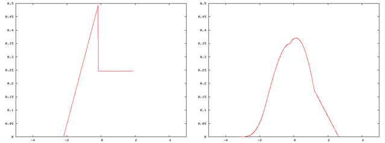
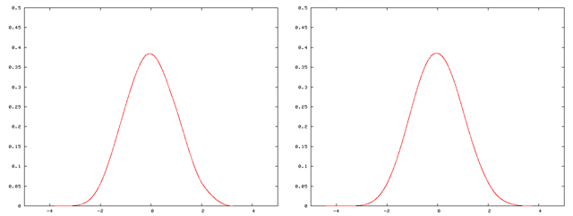

---
## Front matter
lang: ru-RU
title: "Центральная предельная теорема"
subtitle: "*дисциплина: Математическое моделирование*"
author: "Родина Дарья Алексеевна, НФИбд-03-18"

## Formatting
toc: false
slide_level: 2
theme: metropolis
header-includes: 
 - \metroset{progressbar=frametitle,sectionpage=progressbar,numbering=fraction}
 - '\makeatletter'
 - '\beamer@ignorenonframefalse'
 - '\makeatother'
aspectratio: 43
section-titles: true

---

## Введение

**Закон больших чисел**: среднее арифметическое большого числа случайных величин ведет себя как среднее арифметическое их математических ожиданий.

Согласно **центральной предельной теореме** достаточно большая сумма сравнительно малых случайных величин ведет себя как нормальная случайная величина.

Различные формы закона больших чисел **вместе** с различными вариантами центральной предельной теоремы образуют совокупность так называемых **предельных теорем теории вероятностей** и имеют большой практический смысл, так как составляют теоретическую основу математической статистики.

# Центральная предельная теорема

**Центральные предельные теоремы** - класс предельных теорем, определяющих условия возникновения нормального распределения (закона Гаусса). 

**Нормальное распределение** — наиболее распространенное в природе распределение непрерывных величин, возникающее тогда, когда суммируется много независимых (или слабо зависимых) случайных величин, сравнимых по порядку своего влияния на рассеивание суммы. 

Центральная предельная теорема в различных ее формах **устанавливает условия**, при которых возникает нормальное распределение и нарушение которых ведет распределению, отличному от нормального.

## Выборки. Выборочное среднее

- $X \sim F(x)$. 

- выборка объема $n$: $X^n = (X_1, X_2, ..., X_n)$. 

- выборочное среднее: $\bar{X}_n = \frac{1}{n} \displaystyle\sum_{i=1}^{n} X_i$. 

Какое распределение будет иметь новая случайная величина - выборочное среднее $\bar{X_n} \sim ?$

Как это распределение связано с исходным распределением $F(x)$?

## Выборочное среднее производного распределения

## Выборочное среднее производного распределения

## Выводы из центральной предельной теоремы

1. Среднее значение выборочных средних при увеличении количества данных в выборке будет стремиться к истинному среднему, то есть $\chi_{\chi} = \mu$.

2. Дисперсия выборочных средних при увеличении количества данных в выборке стремится к дисперсии совокупности, деленной на объем выборки.

3. Доверительный интервал выборки определяется по следующей формуле:

$$
\delta = \frac{t(n, p)\sigma}{\sqrt{n}},
$$

где - число $t(n, p)$ определяется по специальным таблицам критических точек распределения Стьютента. 

## Заключение

Центральная предельная теорема:

- многозадачна и фундаментальна;
- может быть использована в оценке выбоорок с любыми распределениями;
- погрешность оценки уменьшается с увеличением количества элементов выборки;
- для высокой точности оценки вероятностных событий по значениям выборки можно использовать подсчет доверительных интервалов.

## Список литературы

1. Теория вероятностей и математическая статистика: учеб. пособие / Е. А. Трофимова, Н. В. Кисляк, Д. В. Гилёв; [под общ. ред. Е. А. Трофимовой]; М-во образования и науки Рос. Федерации, Урал. федер. ун-т. – Екатеринбург: Изд-во Урал. ун-та, 2018. – 160 с.

2. Центральная предельная теорема и ее практическое применение - https://helpiks.org/9-64316.html 

3. Central limit theorem - https://en.wikipedia.org/wiki/Central_limit_theorem

4. Математическая статистика: учеб. пособие /Д.К. Агишева, С.А. Зото- ва, Т.А. Матвеева, В.Б. Светличная; ВПИ (филиал) ВолгГТУ. – Волгоград, 2010. – 159 с.: ил.
