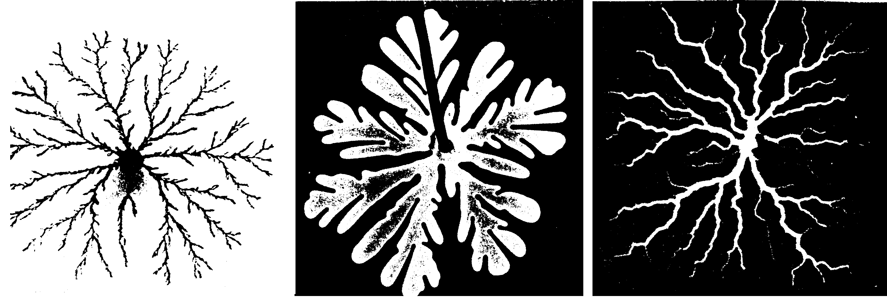
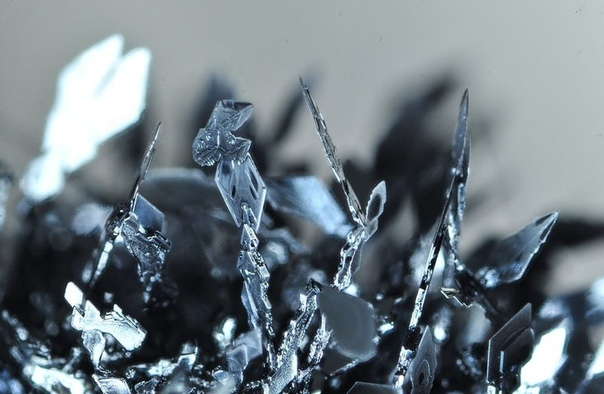

---
# Front matter
lang: ru-RU
title: "Групповой проект. Этап 1"
subtitle: "*дисциплина: Математическое моделирование*"
author: "Родина Дарья Алексеевна, НФИбд-03-18"

# Formatting
toc-title: "Содержание"
toc: true # Table of contents
toc_depth: 2
lof: true # List of figures
lot: true # List of tables
fontsize: 12pt
linestretch: 1.5
papersize: a4paper
documentclass: scrreprt
polyglossia-lang: russian
polyglossia-otherlangs: english
mainfont: PT Serif
romanfont: PT Serif
sansfont: PT Sans
monofont: PT Mono
mainfontoptions: Ligatures=TeX
romanfontoptions: Ligatures=TeX
sansfontoptions: Ligatures=TeX,Scale=MatchLowercase
monofontoptions: Scale=MatchLowercase
indent: true
pdf-engine: lualatex
header-includes:
  - \linepenalty=10 # the penalty added to the badness of each line within a paragraph (no associated penalty node) Increasing the value makes tex try to have fewer lines in the paragraph.
  - \interlinepenalty=0 # value of the penalty (node) added after each line of a paragraph.
  - \hyphenpenalty=50 # the penalty for line breaking at an automatically inserted hyphen
  - \exhyphenpenalty=50 # the penalty for line breaking at an explicit hyphen
  - \binoppenalty=700 # the penalty for breaking a line at a binary operator
  - \relpenalty=500 # the penalty for breaking a line at a relation
  - \clubpenalty=150 # extra penalty for breaking after first line of a paragraph
  - \widowpenalty=150 # extra penalty for breaking before last line of a paragraph
  - \displaywidowpenalty=50 # extra penalty for breaking before last line before a display math
  - \brokenpenalty=100 # extra penalty for page breaking after a hyphenated line
  - \predisplaypenalty=10000 # penalty for breaking before a display
  - \postdisplaypenalty=0 # penalty for breaking after a display
  - \floatingpenalty = 20000 # penalty for splitting an insertion (can only be split footnote in standard LaTeX)
  - \raggedbottom # or \flushbottom
  - \usepackage{float} # keep figures where there are in the text
  - \floatplacement{figure}{H} # keep figures where there are in the text
---

## Что есть дендриты?

Дендрит от греческого слова $\tau o$ $\delta\varepsilon\nu\delta\rho o\nu$, обозначающего *дерево*. 

**Дендриты** - термин широкого употребления, которым обозначаются различные древовидные ветвистые образования. Многие знают это слово из школьного курса биологии как короткий развлевленный отросток нейрона. Однако дендриты в повседневной жизни встречаются гораздо чаще. Достаточно посмотреть на снежинки или на иней. В минералогии дендриты - древовидные разветвленные формы роста кристаллов и агрегатов. Не так наглядно, но практически более важно появление дендритов в металургии при затвердевании различных метаов и сплавов.

## Формирование дендрита

Дендрит представляет собой ветвящееся и расходящееся в стороны образование, возникающее при ускоренной или стеснённой кристаллизации в неравновесных условиях, когда кристалл расщепляется по определённым законам.

**Дендритный рост** -  процесс образования дендрита

По внешнему виду и особенностям процесса роста дендриты представляют србой нечто среднее между обычными четко ограненными кристалами и фрактальными кластерами

Шороховатая поверхность(микроуровень) и выраженая структра (Большой масштаб) связана с наличием **анизотропии**. Дендриты отличаются от истиных кристалов отсутсвием четко выраденных граней. Далее дендрит и кристалл будут употребляться как синонимы.

Мы будемрассматривать комбинированную модель роста дендритов(макро + микроскопический рост)

## Непонятные слова:
**Кла́стер**  — объединение нескольких однородных элементов, которое может рассматриваться как самостоятельная единица, обладающая определёнными свойствами

**Фрактальный кластер** (фрактальный агрегат) — хаотический фрактал, который образуется при ассоциации твердых аэрозолей в газе в случае диффузионного характера их движения, а также в результате конденсации в сложных неравновесных условиях, например, при слипании движущихся по определенному закону твердых частиц кластера (агрегата)

**Ассоциация**  — объединение простых молекул или ионов в более сложные, не вызывающее изменения химической природы вещества.

**Агрегат минеральный** — скопления и срастания минеральных индивидов (кристаллов и зёрен) одного и того же или разных минералов, отделённых друг от друга поверхностями раздела.

**Анизотропи́я** — различие свойств среды (например, физических: упругости, электропроводности, теплопроводности, показателя преломления, скорости звука или света и др.) в различных направлениях внутри этой среды; в противоположность изотропии.
еодинаковостью обладают следующие свойства:

- прочность  
- твердость  
- электрическое сопротивление  
- тепловое расширение

Причина анизотропии — различие плотности упаковки атомов или молекул в решетке в различных направлениях.

## Основные понятия и уравнения

Рассмотрим образование кристалической структуры из переохлажденного расплава. Для роста необходима затравка

Физические свойства вещества
- Плотность $\rho$  
- $L$ - удельная теплота плавления на единицу массы   
- $c_\mathit{p}$ - теплоемкость при постоянном давление(также на единицу массы)  
- $k$ - коэфицент теплопроводности  
- $T_m$ - температура плавления  
- $T_\infty < T_m$  

будем считать теплопроводность и плотность не зависящими от температуры и одинаковыми для твердойи жидкой фаз, то есть наша модель  **Симметричная модель**

Введем безразмерное переохлаждение:
$$S = c_p(T_m-T_\infty)$$

- В адиобатических условиях при $S \geq 1$ затвердивает весь расплав
- $S < 1$ только часть затвердевает(Не рассматриваем этот случай)

**Уравнение теплопроводности**
$$\rho c_p \frac{\delta T}{\delta t } = \nabla^2T \equiv k\bigg(\frac{\delta^2T}{\delta x^2 }+\frac{\delta^2T}{\delta y^2 } \bigg) $$

## Скорость движения границы кристализации

Далее найдем скорость движения границы кристализации перпендикулярной самой себе. $V$ - скорость кристализации

За время  $\Delta t$ на участке польщадью $s$ затвердевает масса вещества равная:
$$\Delta m = \rho sV \Delta t$$

При кристализации выдкляется теплота:

$$\Delta Q = \Delta m L$$

По закону сохранения энергии, все выделившееся тепло должно быть отведено за счет теплопровдоности, суммарный поток тепла на границе:

$$q = -k(\nabla T \mid_l-\nabla T \mid_s)$$

- "$\nabla$"  -  это *градиент*. Например: $\nabla T$ - вектор с компонентами $(\delta T/\delta x, \delta T/\delta y)$  
- $"l"$ и $"s"$ относятся к жидкой(liquid) и твердой(solid) фазам  

Должно выплнятся равенство:

$$qs\Delta t = \Delta Q$$

Из него следует выражение для скорости - *Условие Стефана*:

$$nV = \frac{k}{\rho L}n\big( \nabla T\mid_s - \nabla T \mid_l\big)$$

**n** - вектор единичной длинны, перпендикулярный границе(вектор нормали)

Определим как меняется положение и форма границы затвердевания со временем. Для этого зададим температуру на границе  $T_b$

Мы можем ее принять равной температуре плавления нашего вещества $T_m$.Тогда проблема будет называться Задачей Стефана.Однако тогда граница затвердевания будет неустойчива.

На самаом деле при затвердивании вещества такого не наблюдается. Сушетвует 2 механизма, ограничивающих рост выступов:

1. Первый механизм, связанны поверхностное натяжение(Поверхностная энергия)

Атомы на поверхности имеют меньшее число соседей, находящихся в той же фазе, чем атомы в объеме, поэтому их потенциальная энергия выше. Добавка потенциальной энергии пропорциональна площади поверхности:

$$\Delta E_p = \gamma s$$

**$\gamma$** - коэфицент поверхности натяжения.

Рост выступов приводит к увеличению площади поверхнасти, что энергетически  не выгодно. На выступах число соседей у атомов меньше, чем во впадинах, поэтому атомам выгоднее заполнять впадины, восстранавливая ровную поверхность.

*Математически это выражается условием Гиббса - Томсона*:

$$T_b = T_m\bigg(1 - \frac{\gamma T_m}{\rho L^2R} \bigg)$$

**R** -  радиус кривзны в данной точке границы ( для плоской поверхности $R =  \infty$)

Полезно ввести *капилярный радиус*, размер  образующийся структуры пропорционален $d_0$ :

$$d_0 = \gamma T_m c_p/(\rho L^2)$$

2.  Второй механизм замедления роста выступов.

Cостоия в том, что присоединение атомов к твердой поверхности происходит за время,а которое движующиеся  участки границы успевают переохладится. В простейшем случае влияние этого на температуру границы можно записать так:

$$\Delta T_b =  - T_m\beta V$$

**$\beta$** -кинетический коэфицент

Введем безразмерную температуру $\tilde{T} = c_p(T-T\infty)/L$. Тогда уравнение для $\tilde{T}$:
$$\frac{\delta \tilde{T}}{\delta t} = \chi \nabla^2 \tilde{T}$$

$\tilde{T}$=0 везде, кроме затравки

$\chi = k/\rho c_p$ - *коэффицент температуропроводности*.

При затвердевании всего вещества $\tilde{T}$ повысится на единицу. В дальнейшем опустим ~ у $\tilde{T}$.

### Модель роста дендритов

Пусть у нас есть квадратная область размера N * N узлов, в центре которой задана некоторая затравка. Расстояния между узлами по горизонтали и вертикали обозначим h. Зададим $h=1$, $\Delta t = 1$. Снова обратимся к уравнению теплопроводности
$$\rho c_p \frac{\delta T}{\delta t } = \nabla^2T \equiv k\bigg(\frac{\delta^2T}{\delta x^2 }+\frac{\delta^2T}{\delta y^2 } \bigg) $$

Величина $\nabla^2T$ в узле (*i*, *j*) может быть записана как разница среднего значения температуры в соседних узлах и температуры в самом узле,  $\nabla^2T\approx(\langle T_{(i, j)}\rangle-T_{i,j})/h^2$.

Общая формула для вычисления среднего значения температуры в соседних узлах:
$$\langle T_{(i, j)}\rangle=(T_{i+1,j}+T_{i-1,j}+T_{i,j+1}+T_{i,j-1}+w(T_{i+1,j+1}+T_{i+1,j-1}+T_{i-1,j+1}+T_{i-1,j-1}))/(4+4w)$$

Коэффициент $0\leq w<1$ учитывает влияние диагональных соседей.

Строго говоря,
$$\nabla^2T\approx\frac{\langle T_{(i, j)}\rangle-T_{i,j}}{(4+4w)(1+2w)h^2}$$

//То есть можно записать новое значение температуры $\hat{T}_{i,j}=T_{i,j}+\chi\Delta t\nabla^2T$

Обычно установлкеие температуры происходит гораздо быстрее, чем рост кристалла. Это учтется, если за один шаг процесса роста кристалла $\Delta t$ выполнять $m$ шагов $\Delta t/m$ расчета температуры $m>1$. То есть мы разбиваем шаг по времени $\Delta t$ на $m$ маленьких шагов длительностью $\Delta t/m$ каждый. Новое значение температуры после каждого такого шага вычисляется как $\hat{T}_{i,j}=T_{i,j}+\chi\Delta t\nabla^2T/m$
Такая схема будет устойчива при $\chi\Delta t/(mh^2)<1/4$

####Рост дендрита
Записываем состояние каждого узла $n$. Пусть $n=0$ соответствует жидкой фазе, $n=1$ - твердой. Промежуточные состояния не учитываем. Тогда для затвердевания вещества в узле необходимо, чтобы узел лежал на границе, то есть, имел хотя бы одного соседа с $n=1$, и температура в нем была ниже локальной температуры плавления $T_b$, которая зависит от кривизны границы и скорости ее движения.

Влияние кривизны границы учитывается, если рассмотреть узлы, соседние с данными. Всего может быть четыре ближайших соседа и четыре диагональных. Будем считать, что граница плоская, когда $n=1$ у пяти соседей. Запишем это формально, учитывая, что расстояние по диагонали больше, то есть, эти узлы влияют слабее.
$$1/R\approx s_{i,j}=\displaystyle\sum_{1}^{}n_{i,j}+w_n\displaystyle\sum_{2}^{}n_{i,j}-(\frac{5}{2}+\frac{5}{2}w_n)$$

Первая сумма - по ближайшим соседям, вторая - по диагональным. Коэффициент $0\leq w_n\leq1$ учитывает ослабление влияния соседей с ростом расстояния.

Также необходимо учитывать тепловой шум. В простейшем случае можно прибавлять к температуре в узле некоторую случайную добавку $n_{i,j}\delta$, где $n_{i,j}$ - случайное число, равномерно распределенное в интервале $[-1,1]$, а $\delta$ - величина флуктаций температуры.

Узел, расположенный на границе, меняет свое состояние с жидкого на твердое, если
$$T\leq\tilde{T}_m(1+\eta_{i,j}\delta)+\lambda s_{i,j},$$
где $T_m$ - температура плавления, а $\tilde{T}_m$ - безразмерное начальное переохлаждение, $\lambda$ - капиллярный радиус.
