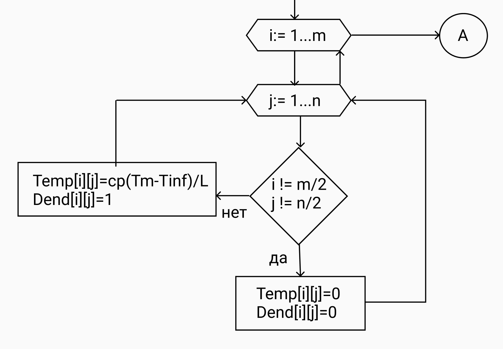
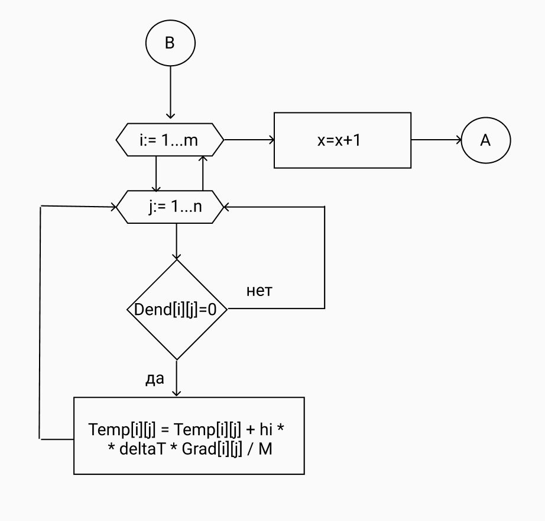

---
## Front matter
lang: ru-RU
title: "Групповой проект. Этап 2"
subtitle: "Рост дендритов"
author: |
	Доборщук Владимир, НФИбд-01-18      
	Голова Варвара, НФИбд-03-18       
	Дяченко Злата, НФИбд-03-18    
	Карташова Алиса, НФИбд-03-18    
	Родина Дарья, НФИбд-03-18  

## Formatting
toc: false
slide_level: 2
theme: metropolis
header-includes:
 - \metroset{progressbar=frametitle,sectionpage=progressbar,numbering=fraction}
 - '\makeatletter'
 - '\beamer@ignorenonframefalse'
 - '\makeatother'
aspectratio: 43
section-titles: true

---

## Задачи проекта
 
1. изучить теоретическую информацию о дендритах, в том числе и о модели роста дендритов;  
2. разработать алгоритмы, позволяющие:  
	- моделировать теплопроводность;  
	- исследовать влияние начального переохлаждения S и величины капиллярного радиуса λ на форму образующихся дендритов;  
	- исследовать зависимость от времени числа частиц в агрегате и его среднеквадратичного радиуса в разных режимах;  
	- определить фрактальную размерность полученных образцов;    
	- исследовать влияние величины теплового шума δ на вид образующихся агрегатов;    
3. написать программу, взяв в основу разработанные ранее алгоритмы;     
4. проанализировать полученные результаты.

## Начальные значения

- m, n   
- Temp[m][n]  
- Grad[m][n]     
- Dend[m][n]   
- S[m][n]  
- M - кол-во изменений температур на одну кристаллизацию   
- x = 0 - счетчик для M   
- w = 1/2 - влияние диагональных соседей   
- h = 1 - расстояние между узлами по горизонтали и вертикали  
- deltaT = 1 - шаг по времени    
- N  
- y = 0 (счетчик для N) 

## Начальные значения

- cp - теплоёмкость   
- L - удельная тепота плавления   
- Tm - температура плавления    
- Tinf  
- l - капиллярный радиус   
- delta - величина флуктуаций температуры  
- k - сумма непустых узлов  
- hi - коэффициент температуропроводности  
- nu[m][n] - случайное число, равномерно распределенное в интервале [-1,1]  

## Начальные значения

## Алгоритм роста дендритов

## Алгоритм роста дендритов

## Алгоритм роста дендритов

## Алгоритм роста дендритов

## Алгоритм роста дендритов

## Алгоритм роста дендритов

