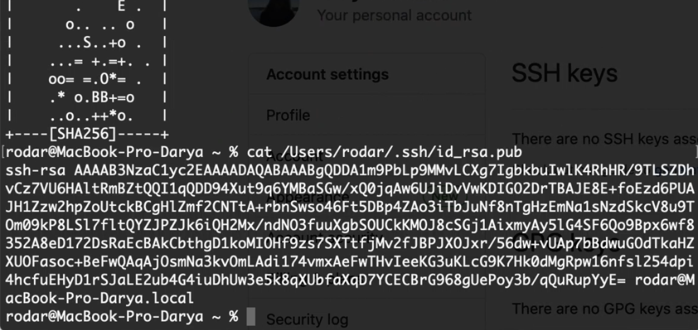

---
# Front matter
lang: ru-RU
title: "Отчет по лабораторной работе №1: Система контроля версий Git"
subtitle: "*дисциплина: Математическое моделирование*"
author: "Родина Дарья Алексеевна, НФИбд-03-18"

# Formatting
toc-title: "Содержание"
toc: true # Table of contents
toc_depth: 2
lof: true # List of figures
lot: true # List of tables
fontsize: 12pt
linestretch: 1.5
papersize: a4paper
documentclass: scrreprt
polyglossia-lang: russian
polyglossia-otherlangs: english
mainfont: PT Serif
romanfont: PT Serif
sansfont: PT Sans
monofont: PT Mono
mainfontoptions: Ligatures=TeX
romanfontoptions: Ligatures=TeX
sansfontoptions: Ligatures=TeX,Scale=MatchLowercase
monofontoptions: Scale=MatchLowercase
indent: true
pdf-engine: luatex
header-includes:
  - \linepenalty=10 # the penalty added to the badness of each line within a paragraph (no associated penalty node) Increasing the value makes tex try to have fewer lines in the paragraph.
  - \interlinepenalty=0 # value of the penalty (node) added after each line of a paragraph.
  - \hyphenpenalty=50 # the penalty for line breaking at an automatically inserted hyphen
  - \exhyphenpenalty=50 # the penalty for line breaking at an explicit hyphen
  - \binoppenalty=700 # the penalty for breaking a line at a binary operator
  - \relpenalty=500 # the penalty for breaking a line at a relation
  - \clubpenalty=150 # extra penalty for breaking after first line of a paragraph
  - \widowpenalty=150 # extra penalty for breaking before last line of a paragraph
  - \displaywidowpenalty=50 # extra penalty for breaking before last line before a display math
  - \brokenpenalty=100 # extra penalty for page breaking after a hyphenated line
  - \predisplaypenalty=10000 # penalty for breaking before a display
  - \postdisplaypenalty=0 # penalty for breaking after a display
  - \floatingpenalty = 20000 # penalty for splitting an insertion (can only be split footnote in standard LaTeX)
  - \raggedbottom # or \flushbottom
  - \usepackage{float} # keep figures where there are in the text
  - \floatplacement{figure}{H} # keep figures where there are in the text
---

# Введение

## Цель работы

Основной целью лабораторной работы можно считать ознакомление с системой контроля версий Git. 

## Задачи работы

Можно выделить три основные задачи данной лабораторной работы:
1. ознакомление с системой контроля версий Git;
2. создание каталогов для хранения данных последующих лабораторнвх работ с их выгрузкой на Github;
3. ознакомление с набором расширений git-flow.

## Объект и предмет исследования

Объектом исследований для данной лабораторной работы является система котроля версий git, предметом же исследования можно считать непосредственное взаимодействие с git, его преимущества и особенности, а также использование платформы GitHub для размещение git-репозиториев.

# Терминология. Условные обозначения

**git** - это бесплатная распределенная система контроля версий с открытым исходным кодом, предназначенная для быстрого и эффективного управления всеми проектами любого размера.

[**GitHub**](https://github.com) - крупнейший веб-сервис для хостинга IT-проектов и их совместной разработки. Веб-сервис основан на системе контроля версий Git и разработан на Ruby on Rails и Erlang компанией GitHub, Inc. 

**git-flow** — это набор расширений git предоставляющий высокоуровневые операции над репозиторием для поддержки модели ветвления Vincent Driessen.

[**Homebrew**](https://brew.sh) — утилита командной строки в macOS и Linux, которая позволяет устанавливать пакеты и приложения (менеджер пакетов). Распространяется как свободное программное обеспечение с открытым кодом. 

# Выполнение лабораторной работы

Для того, чтобы использовать git на своем устройстве, для начала необходимо его установить. Так как в моем случае git уже был установлен, данный пункт работы был пропущен. Но, в случае, если бы на моем устройстве не был бы установлен данный пакет, я бы воспользовалась менеджером пакетов Homebrew для установки: 

```sh
      brew install git
```

## Установка имени и электронной почты

Для того, чтобы git узнал имя и адрес электронный почты пользователя, необходимо выполнить следующие команды (рис. -@fig:001):

```sh
      git config --global user.name ""
      git config --global user.email "1032182581@pfru.ru"
```

## Параметры установки окончаний строк

Настроила core.autocrlf с параметром input для того, чтобы все переводы строк текстовых файлов в главном репозитории одинаковы были одинаковы. Конвертация CRLF в LF будет производиться только при коммитах (подходит для моей ОС - macOS).
При настроенном core.safecrlf в true, git будет проверять, если преобразование является обратимым для текущей настройки core.autocrlf, то есть core.safecrlf true - отвержение необратимого преобразования lf<->crlf (рис. -@fig:001): 

```sh
      git config --global core.autocrlf input 
      git config --global core.safecrlf true
```

## Установка отображения unicode

Что бы избежать нечитаемых строк, установила соответствующий флаг (рис. -@fig:001): 

```sh
      git config --global core.quotepath off
```

{ #fig:001 width=70% }

## Создание SSH-ключа с последующей выгрузкой на GitHub

Так как у меня уже имеется учетная запись на GitHub, то мне просто нужно сгенерировать SSH-ключ и выгрузить его на GitHub. 

Генерация ключа и его последующее "изымание" из файла, в котором он записан, происходит при помощи следующих команд (рис. -@fig:002, рис. -@fig:003): 

```sh 
      ssh-keygen -t rsa
      cat /Users/rodar/.ssh/id-rsa.pub
```
{ #fig:002 width=70% }

{ #fig:003 width=70% }

Далее в настройках профиля на GitHub, во вкладке "SSH and GPG keys" необходимо добавить новый SSH-ключ. Это необходимо для быстрого доступа к репозиториям, которые созданы в моей учетной записи (рис. -@fig:004). 

{ #fig:004 width=70% }

## Создание каталога для последующей работы и его выгрузка на GitHub

Для дальнейшей работы с лабораторными работами и проектами необходимо создать директорию с определенной иерархией, которая была предложена ранее. Также была добавлена папка для файлов первой (данной) лабораторной работы (рис. -@fig:005): 

```sh
      cd Documents 
      mkdir work
      mkdir work/2020-2021
      mkdir work/2020-2021/mathmodel
      mkdir work/2020-2021/mathmodel/laboratory
      mkdir work/2020-2021/mathmodel/laboratory/lab1
```

{ #fig:005 width=70% }

Далее необходимо создать новый репозиторий в GitHub (рис. -@fig:006):

{ #fig:006 width=70% }

Для того, чтобы не инициализировать пустой репозиторий, добавим следуюищий файл с текстом "Hello, World!" (рис. -@fig:007, рис. -@fig:008):

```sh
    cd lab1
    mkdir hello
    touch hello.html
    nano hello.html
```
{ #fig:007 width=70% }

{ #fig:008 width=70% }

Далее необходимо было выполнить (рис. -@fig:009):

1. создание репозитория git ('git init');

2. добавление всех созданных файлов в репозиторий('git add .');

3. коммит этого этапа ('git commit -m "Initial Commit"');

4. проверка текущего состояния репозитория ('git status');

5. "привязка" репозитория на GitHub к текущему репозиторию ('git remote add origin git@github.com:RoDar203/work.git');

6. отправка изменений ветки "master" ('git push -u origin master').

```sh
      cd ~/Documents/work
      git init
      git add . 
      git commit -m "Initial Commit"
      git status
      git remote add origin git@github.com:RoDar203/work.git 
      git push -u origin master
```

{ #fig:009 width=70% }

Можно увидеть, что в репозитории на GitHub появились данные, которые были добавлены при помощи git (рис. -@fig:010): 

{ #fig:010 width=70% }

## Работа с git-flow

В данной лабораторной работе взаимодействие с git-flow осуществляется посредством работы над отчетом и презентацией. Следовательно, добавить в отчет можно лишь часть процесса для более эффективной работы. 

Первым делом необходимо скачать git-flow:

```sh
      brew install git-flow
```

Далее необходимо инициализировать git-flow в директории work: 

```sh
      git flow init 
```

После этого мы окажемся на ветке "develop". Для того, чтобы процесс создания отчета был максимально независимым от работы над другими частями лабораторной работы, необходимо переключиться из ветки "develop" на векту фич:

```sh
      git flow feature start MYFEATURE
```

После окончания работы над отчетом производится сохранение всех изменений и  
# Выводы

В ходе выполнения лабораторной работы были изучены основные особенности системы контроля версий git, а также специфика выполнения и оформления лабораторных работ для данной дисциплины. 

## ССылки на ресурсы

Видео с выполнением работы: [https://youtu.be/8sznIfBZaMA](https://youtu.be/8sznIfBZaMA)

Ссылка на репозиторий с файлами работы: [https://github.com/RoDar203/work](https://github.com/RoDar203/work)