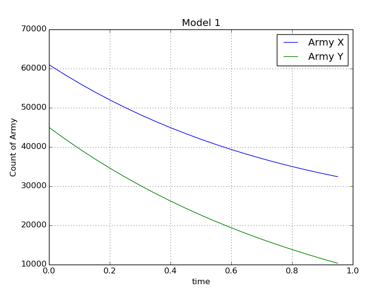
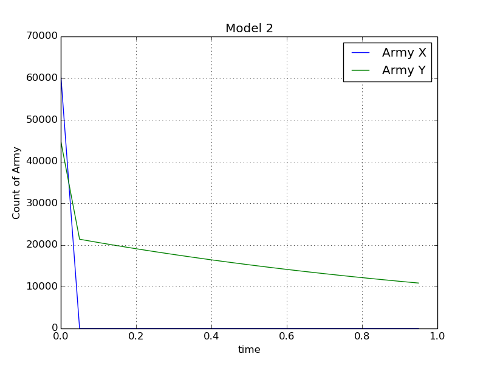

---
## Front matter
lang: ru-RU
title: "Лабораторная работа №3. Модель боевых действий"
subtitle: "*дисциплина: Математическое моделирование*"
author: "Родина Дарья Алексеевна, НФИбд-03-18"

## Formatting
toc: false
slide_level: 2
theme: metropolis
header-includes:
 - \metroset{progressbar=frametitle,sectionpage=progressbar,numbering=fraction}
 - '\makeatletter'
 - '\beamer@ignorenonframefalse'
 - '\makeatother'
aspectratio: 43
section-titles: true

---

# Введение

**Цель работы:** ознакомление с простейшими моделями боевых действий - моделями Ланчестера. 

**Задачи работы:**  
1. изучение моделей Ланчестера для тред случаев ведения боевых действий;  
2. написать код, при помощи которого можно построить графики изменения численности войск армий для случаев, указанных в том варианте работы, который необходимо выполнить. 

**Объектом исследования** третьей лабораторной работы можно считать модели Ланчестера. **Предметом исследования** можно считать случаи, которые рассматриваются в моем варианте лабораторной работе. 

# Постановка задачи 

Между страной $X$ и страной $Y$ идет война. Численности состава войск исчисляются от начала войны, и являются временными функциями $x(t)$ и $y(t)$. В начальный момент времени страна $X$ имеет армию численностью $61 000$ человек, а в распоряжении страны $Y$ армия численностью $45 000$ человек. Для упрощения модели считаем, что коэфициенты $a, b, c, h$ постоянны. Также считаем $P(t)$ и $Q(t)$ непрерывными функциями. Постройте графики изменения численности войск армий для следующих случаев:
 
## Постановка задачи

1. Модель боевых действий между регулярными войсками

$$ 
\frac{dx}{dt} = -0.22x(t) - 0.82y(t) + 2\sin(4t) 
$$

$$ 
\frac{dy}{dt} = -0.45x(t) - 0.67y(t) + 2\cos(4t)
$$

## Постановка задачи

2. Модель ведение боевых действий с участием регулярных войск и партизанских отрядов

$$ 
\frac{dx}{dt} = -0.28x(t) - 0.83y(t) + 1.5\sin(t) 
$$

$$ 
\frac{dy}{dt} = -0.31x(t)y(t) - 0.75y(t) + 1.5\cos(t)
$$

# Реализация 

## Инициализация бибилиотек

```py
	import numpy as np
	from math import sin, cos
	from scipy.integrate import odeint
	import matplotlib.pyplot as plt
```

## Начальные значения

```py
	x0 = 61000
	y0 = 45000

	v0 = np.array([x0, y0])

	t0 = 0
	tmax = 1
	dt =0.05

	t = np.arange(t0, tmax, dt)
```

## Константы, необходимые для решения дифференциальных уравнений

Первая модель:

```py 
	a = 0.22
	b = 0.82
	c = 0.45
	h = 0.67
```

Вторая модель:

```py
	a = 0.28
	b = 0.83
	c = 0.31
	h = 0.75
```

## Функции возможности подхода подкрепления к армиям 

Первая модель:

```py
	def P(t):
	    p = 2*sin(4*t)
	    return p

	def Q(t):
	    q = 2*cos(4*t)
	    return q
```
## Функции возможности подхода подкрепления к армиям 

Вторая модель:

```py
	def P(t):
	    p = 1.5*sin(t)
	    return p

	def Q(t):
	    q = 1.5*cos(t)
	    return q
```

## Система дифференциальных уравнений

Первая модель:

```py
	def syst(y, t):
	    dy1 = - a*y[0] - b*y[1] + P(t)
	    dy2 = - c*y[0] - h*y[1] + Q(t)
	    return [dy1, dy2]
```

Вторая модель:

```py
	def syst(y, t):
	    dy1 = - a*y[0] - b*y[0]*y[1] + P(t)
	    dy2 = - c*y[0]*y[1] - h*y[1] + Q(t)
	    return [dy1, dy2]
```

## Решение дифференциального уравнения и построение графиков

```py
	y = odeint(syst, v0, t)

	xpoint = [elem[0] for elem in y] 
	ypoint = [elem[1] for elem in y]

	plt.title("Model [1/2]")
	plt.plot(t, xpoint, label = 'Army X')
	plt.plot(t, ypoint, label = 'Army Y')

	plt.xlabel('time')
	plt.ylabel('Count of Army')
	plt.legend()
	plt.grid()
	plt.show()
```

## Модель 1. Изменение численности армии X и Y в процессе боевых действий



## Модель 2. Изменение численности армии X и Y в процессе боевых действий




# Выводы

В ходе выполнения лабораторной работы было проведено ознакомление с простейшими моделями боевых действий. 

По построенным графикам моделей можно сделать вывод, что при участии партизанских отрядов, армия Y с большой вероятностью выйграет битву, в то время как армия X потерпит сокрушительное поражение. Если же партизанскии отряды не будут принимать участие в битве, то армия Y с большей вероятностью потерпит поражение, нежели чем армия X. 