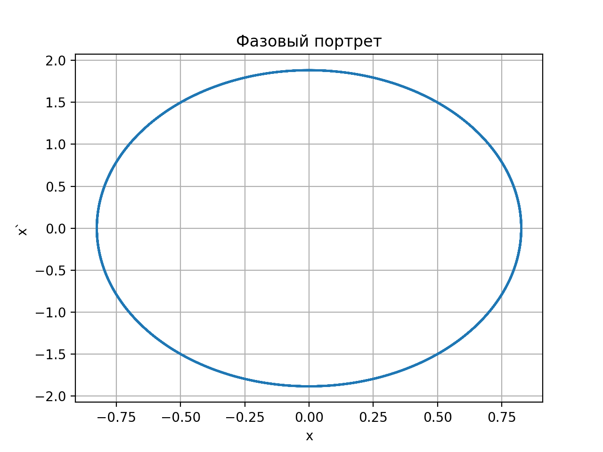
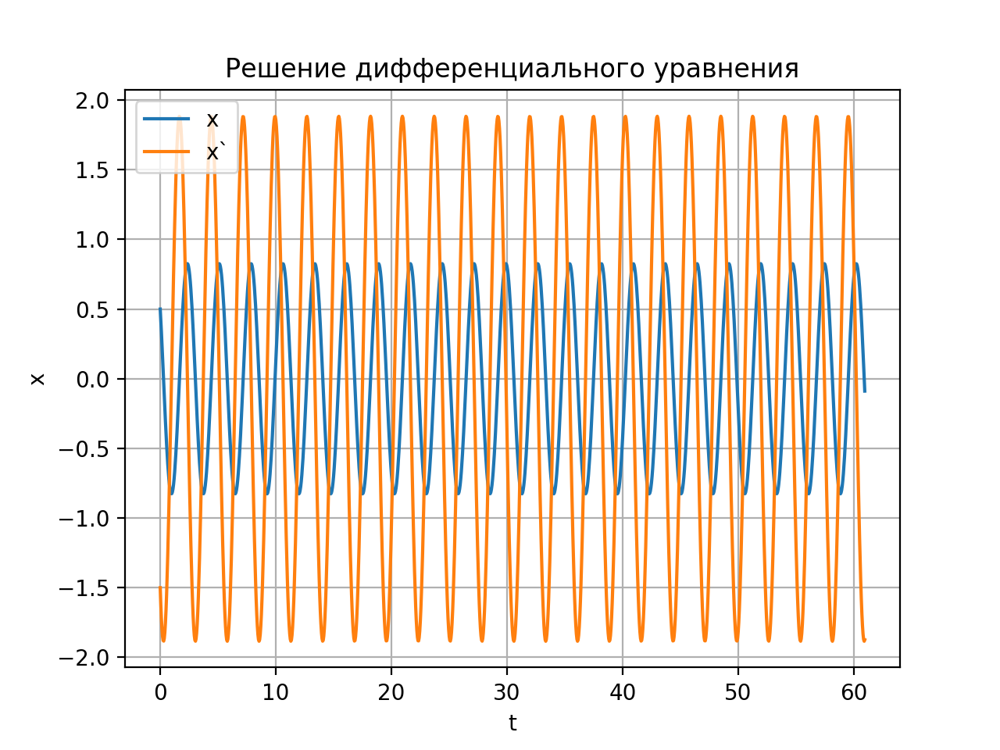

---
## Front matter
lang: ru-RU
title: "Отчет по лабораторной работе №4: Модель гармонических колебаний"
subtitle: "*дисциплина: Математическое моделирование*"
author: "Родина Дарья Алексеевна, НФИбд-03-18"

## Formatting
toc: false
slide_level: 2
theme: metropolis
header-includes:
 - \metroset{progressbar=frametitle,sectionpage=progressbar,numbering=fraction}
 - '\makeatletter'
 - '\beamer@ignorenonframefalse'
 - '\makeatother'
aspectratio: 43
section-titles: true

---

# Введение 

**Целью лабораторной работы** можно считать ознакомление с моделью гармонических колебаний. 

**Задачи лабораторной работы:**  
1. изучение модели гармонических колебаний;  
2. написать код, при помощи которого можно построить графики фазового портрета для случаев, указанных в моем варианте лабораторной работы. 

**Объектом исследования** четвертой лабораторной работы можно считать модель гармонических колебаний. **Предметами же исследования** можно считать случаи, которые рассматриваются в моем варианте лабораторной работе. 

# Модель гармонических колебаний

## Линейный гармонический осциллятор 

**Линейный гармонический осциллятор** - модель, выступающая в качестве основной модели в теории колебаний. Данной моделью можно описать многие системы в физике, химии, биологии и других науках при определенных предположениях.   

## Простейшая модель гармонических колебаний

Уравнение свободных колабаний гармонического осциллятора имеет следующий вид: 

$$
\ddot{x} + 2 \gamma \dot{x} + \omega_{0}^{2} x = 0
$$

## Модель математического маятника

Простейшую модель математического маятника можно описать так: при отсутствии потерь в системе ($\gamma = 0$) получаем уравнение консеравтивного осциллятора, энергия колебания которого сохранятеся во времени: 

$$
\ddot{x} + \omega_{0}^{2} = 0
$$

где $\omega_{0}$ высчитывается из второго закона Ньютона.

## Алгоритм перехода от дифференциального уравнения второго порядка к двум дифференциальным уравнениям первого порядка

Для однозначной разрешимости уравнения второго порядка необходимо два начальных условия вида

$$
\begin{cases}
	x (t_0) = x_0
\\
	\dot{x} (t_0) = y_0
\end{cases}
$$

## Алгоритм перехода от дифференциального уравнения второго порядка к двум дифференциальным уравнениям первого порядка

Уравнение второго порядка можно представить в виде системы двух уравнений первого порядка: 

$$
\begin{cases}
	\dot{x} = y
\\
	\dot{y} = - \omega_{0}^{2} x
\end{cases}
$$

Начальные условия для системы примут вид: 

$$
\begin{cases}
	x (t_0) = x_0
\\
	y (t_0) = y_0
\end{cases}
$$

## Фазовый портрет и фазовая траектория

**Фазовое пространство (плоскость) системы** - пространство, которое определяют независимые переменные $x$ и $y$, в котором "движется" решение. Значение фазовых координат $x$, $y$ в любой момент времени полностью определяет состояние системы. 

**Фазовая траектория** - гладкая кривая, которая отвечает решению уравнения движения как функции времени. 

**Фазовый портрет** - картина, образованная набором фазовых траекторий. 

## Формулировка задачи 

**Вариант 32**

Постройте фазовый портрет гармонического осциллятора и решение уравнения гармонического осциллятора для следующих случаев:

1. колебания гармонического осциллятора без затуханий и без действий внешней силы $\ddot{x} + 5.2x = 0$;

2. колебания гармонического осциллятора c затуханием и без действий внешней силы $\ddot{x} + 14 \ddot{x} + 0.5x = 0$;

3. колебания гармонического осциллятора c затуханием и под действием внешней силы $\ddot{x} + 13 \dot{x} + 0.3x = 0.8 \sin{9t}$;

на интервале $t \in [0;59]$ (шаг $0.05$) с начальными условиями $x_0 = 0.5$, $y_0 = -1.5$.

## Подключение библиотек

```py
	import numpy as np
	from math import sin, cos, sqrt
	from scipy.integrate import odeint
	import matplotlib.pyplot as plt
```

## Функции, описывающие дифференциальные уравнения

```py 
	# Правая часть уравнения f(t)
	def F(t):
		f = 0
		return f
```

## Функции, описывающие дифференциальные уравнения

```py
	# первый случай
	f = 0

	# второй случай
	f = 0

	# третий случай
	f = 0.8 * sin(9 * t)
```

## Функции, описывающие дифференциальные уравнения

```py 
		# Вектор-функция f(t, x)
		# для решения системы дифференциальных уравнений
		# x' = y(t, x)
		# где x - искомый вектор
		def dx(x, t):
			dx1 = x[1]
			dx2 = -w* w* x[0] - g * x[1] - F(t)
			return [dx1, dx2]
```

## Построение фазового портрета

```py
# Функцкия построения графика зависимости
	def draw_plot(x, y):
		plt.plot(x, y)
		plt.xlabel('x')
		plt.ylabel('y')
		plt.grid()
		plt.show()
```

## Построения графика решений

```py
# Функция построения графика решения
def draw_plot(x, y, t):
	plt.plot(t, x, label = 'x')
	plt.plot(t, y, label = 'x`')
	plt.title("Решение дифференциального уравнения")
	plt.xlabel('t')
	plt.ylabel('x')
	plt.legend()
	plt.grid()
	plt.show()
```

## Начальные значения

```py 
	t0 = 0 # Начальный момент времени 
	tmax = 59 # Конечный момент времени 
	dt = 0.05 # Шаг изменения времени

	# Интервал, в котором решается задача
	t = np.arange(t0, tmax, dt)

	# Начальные условия
	# x(t0) = x0
	x0 = 0.5
	y0 = -1.5

	# Вектор начальных условий
	v0 = np.array([x0, y0])
```

## Начальные значения

```py 
	# Параметры осциллятора 
	# x'' + g* x' + w^2* x = f(t) 
	# w - частота
	# g - затухание
	w = sqrt(1)
	g = 0
```

## Начальные значения

```py
	# первый случай
	w = sqrt(5.2)
	g = 0

	# второй случай
	w = sqrt(0.5)
	g = 14

	# третий случай
	w = sqrt(0.3)
	g = 13
```

## Решение диффееренциального уравнения и построение графика

```py
	# Решаем дифференциальные уравнения
	# с начальным условием x(t0) = x0
	# на интервале t
	# с правой частью, заданной y
	# и записываем решение в матрицу x
	x = odeint(dx, v0, t)

	# Переписываем отдельно 
	# x в xpoint, x' в ypoint
	xpoint = [elem[0] for elem in x] 
	ypoint = [elem[1] for elem in x]

	# Построим график
	draw_plot(xpoint, ypoint)


	# Построим график решений
	draw_plot(xpoint, ypoint, t)
```

# Построенные графики

## Первый случай

{ #fig:001 width=70% }

## Первый случай

{ #fig:002 width=70% }

## Второй случай

{ #fig:003 width=70% }

## Второй случай

{ #fig:004 width=70% }

## Третий случай 

{ #fig:005 width=70% }

## Третий случай 

{ #fig:006 width=70% }

# Выводы

В ходе выполнения лабораторной работы было проведено ознакомление с простейшими моделями гармонического осциллятора, а также построены фазовые портреты моделей. 