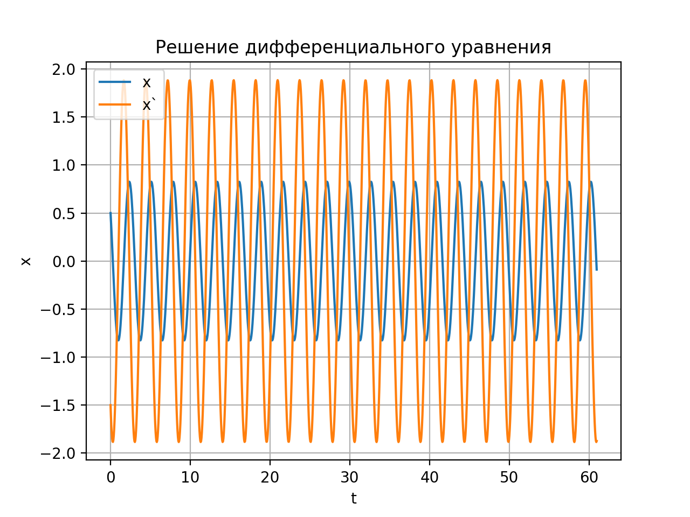

---
# Front matter
lang: ru-RU
title: "Отчет по лабораторной работе №4: Модель гармонических колебаний"
subtitle: "*дисциплина: Математическое моделирование*"
author: "Родина Дарья Алексеевна, НФИбд-03-18"


# Formatting
toc-title: "Содержание"
toc: true # Table of contents
toc_depth: 2
lof: true # List of figures
fontsize: 12pt
linestretch: 1.5
papersize: a4paper
documentclass: scrreprt
polyglossia-lang: russian
polyglossia-otherlangs: english
mainfont: PT Serif
romanfont: PT Serif
sansfont: PT Sans
monofont: PT Mono
mainfontoptions: Ligatures=TeX
romanfontoptions: Ligatures=TeX
sansfontoptions: Ligatures=TeX,Scale=MatchLowercase
monofontoptions: Scale=MatchLowercase
indent: true
pdf-engine: lualatex
header-includes:
  - \linepenalty=10 # the penalty added to the badness of each line within a paragraph (no associated penalty node) Increasing the value makes tex try to have fewer lines in the paragraph.
  - \interlinepenalty=0 # value of the penalty (node) added after each line of a paragraph.
  - \hyphenpenalty=50 # the penalty for line breaking at an automatically inserted hyphen
  - \exhyphenpenalty=50 # the penalty for line breaking at an explicit hyphen
  - \binoppenalty=700 # the penalty for breaking a line at a binary operator
  - \relpenalty=500 # the penalty for breaking a line at a relation
  - \clubpenalty=150 # extra penalty for breaking after first line of a paragraph
  - \widowpenalty=150 # extra penalty for breaking before last line of a paragraph
  - \displaywidowpenalty=50 # extra penalty for breaking before last line before a display math
  - \brokenpenalty=100 # extra penalty for page breaking after a hyphenated line
  - \predisplaypenalty=10000 # penalty for breaking before a display
  - \postdisplaypenalty=0 # penalty for breaking after a display
  - \floatingpenalty = 20000 # penalty for splitting an insertion (can only be split footnote in standard LaTeX)
  - \raggedbottom # or \flushbottom
  - \usepackage{float} # keep figures where there are in the text
  - \floatplacement{figure}{H} # keep figures where there are in the text
---

# Введение 

## Цель работы

Основной целью лабораторной работы можно считать ознакомление с моделью гармонических колебаний. 

## Задачи работы

Можно выделить следующие задачи четвертой лабораторной работы:  
1. изучение модели гармонических колебаний;  
2. написать код, при помощи которого можно построить графики фазового портрета для случаев, указанных в моем варианте лабораторной работы. 

## Объект и предмет исследования

Объектом исследования четвертой лабораторной работы можно считать модель гармонических колебаний. Предметами же исследования можно считать случаи, которые рассматриваются в моем варианте лабораторной работе. 

# Модель гармонических колебаний

## Линейный гармонический осциллятор 

**Линейный гармонический осциллятор** - модель, выступающая в качестве основной модели в теории колебаний. Данной моделью можно описать многие системы в физике, химии, биологии и других науках при определенных предположениях.   

## Простейшая модель гармонических колебаний

Уравнение свободных колабаний гармонического осциллятора имеет следующий вид: 

$$
\ddot{x} + 2 \gamma \dot{x} + \omega_{0}^{2} x = 0
$$

где $x$ - переменная, описывающая состояние системы, $\gamma$ - параметр, характеризующий потери эненргии, $\omega_{0}$ - свободная частота колебаний, $t$ - время, $\ddot{x} = \frac{\delta^{2} x}{\delta t^{2}}$, $\dot{x} = \frac{\delta x}{\delta t}$. 

Соответственно, данное уравнение - линейное однородное дифференциальное уравнение второго порядка, которое является примером линейной динамической системы. 

## Модель математического маятника

Простейшую модель математического маятника можно описать так: при отсутствии потерь в системе ($\gamma = 0$) получаем уравнение консеравтивного осциллятора, энергия колебания которого сохранятеся во времени: 

$$
\ddot{x} + \omega_{0}^{2} = 0
$$

где $\omega_{0}$ высчитывается из второго закона Ньютона.

## Алгоритм перехода от дифференциального уравнения второго порядка к двум дифференциальным уравнениям первого порядка

Для однозначной разрешимости уравнения второго порядка необходимо два начальных условия вида

$$
\begin{cases}
	x (t_0) = x_0
\\
	\dot{x} (t_0) = y_0
\end{cases}
$$

Уравнение второго порядка можно представить в виде системы двух уравнений первого порядка: 

$$
\begin{cases}
	\dot{x} = y
\\
	\dot{y} = - \omega_{0}^{2} x
\end{cases}
$$

Начальные условия для системы примут вид: 

$$
\begin{cases}
	x (t_0) = x_0
\\
	y (t_0) = y_0
\end{cases}
$$

## Фазовый портрет и фазовая траектория

**Фазовое пространство (плоскость) системы** - пространство, которое определяют независимые переменные $x$ и $y$, в котором "движется" решение. Значение фазовых координат $x$, $y$ в любой момент времени полностью определяет состояние системы. 

**Фазовая траектория** - гладкая кривая, которая отвечает решению уравнения движения как функции времени. 

**Фазовый портрет** - картина, образованная набором фазовых траекторий. 

# Выполнение лабораторной работы

## Формулировка задачи из варианта

Так как в третьей лабораторной работе 70 вариантов, то номер моего варианта вычисляется по формуле $S_n mod 70 + 1$, где $S_n$ - номер студенческого билета (в моем случае $S_n = 1032182581$):
 
```py
  1032182581%70 + 1
```

Соответственно, номер моего варианта - 32. 

**Вариант 32**

Постройте фазовый портрет гармонического осциллятора и решение уравнения гармонического осциллятора для следующих случаев:

1. колебания гармонического осциллятора без затуханий и без действий внешней силы $\ddot{x} + 5.2x = 0$;

2. колебания гармонического осциллятора c затуханием и без действий внешней силы $\ddot{x} + 14 \ddot{x} + 0.5x = 0$;

3. колебания гармонического осциллятора c затуханием и под действием внешней силы $\ddot{x} + 13 \dot{x} + 0.3x = 0.8 \sin{9t}$;

на интервале $t \in [0;59]$ (шаг $0.05$) с начальными условиями $x_0 = 0.5$, $y_0 = -1.5$.

## Реализация алгоритмов

Решение лабораторной работы может быть реализовано на многих языках программирования. В моем случае это язык программирования Python. Далее будет представлен код на этом языке программирования.

### Подключение библиотек

Для того, чтобы использовать многие формулы, а также для построения графиков, необходимо подключить определенные библиотеки, в которых эти формулы описаны:

```py
	import numpy as np
	from math import sin, cos, sqrt
	from scipy.integrate import odeint
	import matplotlib.pyplot as plt
```
### Функции, описывающие дифференциальные уравнения

Общий вид функции, описывающей правую часть дифференциального уравнения, имеет вид:

```py 
	# Правая часть уравнения f(t)
	def F(t):
		f = 0
		return f
```

где строка 'f = 0' имеет следующие значения:

```py
	# первый случай
	f = 0

	# второй случай
	f = 0

	# третий случай
	f = 0.8 * sin(9 * t)
```

Функция для решение системы дифференциальных уравнений имеет вид: 

```py 
		# Вектор-функция f(t, x)
		# для решения системы дифференциальных уравнений
		# x' = y(t, x)
		# где x - искомый вектор
		def dx(x, t):
			dx1 = x[1]
			dx2 = -w* w* x[0] - g * x[1] - F(t)
			return [dx1, dx2]
```

### Построение графика функции 

Для удобства вынесем построение графиков в отдельные функции:

```py
# Функцкия построения фазового портрета
def draw_f_plot(x, y):
	plt.plot(x, y)
	plt.title("Фазовый портрет")
	plt.xlabel('x')
	plt.ylabel('x`')
	plt.grid()
	plt.show()
```

```py
# Функция построения графика решения
def draw_plot(x, y, t):
	plt.plot(t, x, label = 'x')
	plt.plot(t, y, label = 'x`')
	plt.title("Решение дифференциального уравнения")
	plt.xlabel('t')
	plt.ylabel('x')
	plt.legend()
	plt.grid()
	plt.show()
```

### Начальные значения

В задаче присутствуют как общие для всех трех случаев начальные значения, так и локальные. Далее будут приведены значения, общие для всех трех случаев: 

```py 
	t0 = 0 # Начальный момент времени 
	tmax = 59 # Конечный момент времени 
	dt = 0.05 # Шаг изменения времени

	# Интервал, в котором решается задача
	t = np.arange(t0, tmax, dt)

	# Начальные условия
	# x(t0) = x0
	x0 = 0.5
	y0 = -1.5

	# Вектор начальных условий
	v0 = np.array([x0, y0])
```

Также в задаче присутствуют несколько начальных значений, различных для трех случаев. В общем виде они задаются в программе следующим образом:

```py 
	# Параметры осциллятора 
	# x'' + g* x' + w^2* x = f(t) 
	# w - частота
	# g - затухание
	w = sqrt(1)
	g = 0
```

где:

```py
	# первый случай
	w = sqrt(5.2)
	g = 0

	# второй случай
	w = sqrt(0.5)
	g = 14

	# третий случай
	w = sqrt(0.3)
	g = 13
```

### Решение диффееренциального уравнения и построение графика

```py
	# Решаем дифференциальные уравнения
	# с начальным условием x(t0) = x0
	# на интервале t
	# с правой частью, заданной y
	# и записываем решение в матрицу x
	x = odeint(dx, v0, t)

	# Переписываем отдельно 
	# x в xpoint, x' в ypoint
	xpoint = [elem[0] for elem in x] 
	ypoint = [elem[1] for elem in x]

	# Построим фазовый портрет
	draw_plot(xpoint, ypoint)

	# Построим график решений
	draw_plot(xpoint, ypoint, t)
```

## Построенные графики

### Первый случай

Колебания гармонического осциллятора без затуханий и без действий внешней силы $\ddot{x} + 5.2x = 0$ имеют следующий фазовый портрет (рис. -@fig:001) и график решений уравнения (рис. -@fig:002):

{ #fig:001 width=70% }

{ #fig:002 width=70% }

### Второй случай

Колебания гармонического осциллятора c затуханием и без действий внешней силы $\ddot{x} + 14 \ddot{x} + 0.5x = 0$ имеют следующий фазовый портрет (рис. -@fig:003) и график решений уравнения (рис. -@fig:004):

{ #fig:003 width=70% }

{ #fig:004 width=70% }

### Третий случай 

Колебания гармонического осциллятора c затуханием и под действием внешней силы $\ddot{x} + 13 \dot{x} + 0.3x = 0.8 \sin{9t}$ имеют следующий фазовый портрет (рис. -@fig:005) и график решений уравнения (рис. -@fig:006):

{ #fig:005 width=70% }

{ #fig:006 width=70% }

# Выводы

В ходе выполнения лабораторной работы было проведено ознакомление с простейшими моделями гармонического осциллятора, а также построены фазовые портреты моделей. 