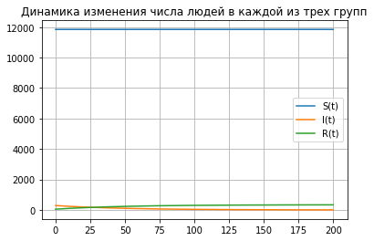
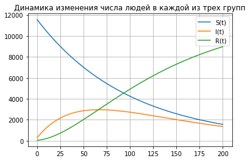

---
## Front matter
lang: ru-RU
title: "Отчет по лабораторной работе №6: Задача об эпидемии"
subtitle: "*дисциплина: Математическое моделирование*"
author: "Родина Дарья Алексеевна, НФИбд-03-18"

## Formatting
toc: false
slide_level: 2
theme: metropolis
header-includes:
 - \metroset{progressbar=frametitle,sectionpage=progressbar,numbering=fraction}
 - '\makeatletter'
 - '\beamer@ignorenonframefalse'
 - '\makeatother'
aspectratio: 43
section-titles: true

---

# Введение

Основной **целью лабораторной работы** можно считать ознакомление с задачей об эпидемии.

Можно выделить три основные **задачи данной лабораторной работы**:  
1. изучение теоретической части;  
2. реализация модели на языке программирования python. 

**Объектом исследования** в данной лабораторной работе является задача об эпидемии, а **предметом исследования** - задача, описанная в моем варианте лабораторной работы.

# Простейшая модель эпидемии

$N$ - число особей популяции, которая подразделяется на три группы:  
1. $S(t)$ - восприимчивые к болезни, но пока здоровые особи;  
2. $I(t)$ - число инфицированных особей, которые также являются распространителями инфекции;  
3. $R(t)$ - здоровые особи с иммунитетом к болезни.  
Считаем, что все больные изолированы и не заражают здоровых. 

## Восприимчивые к болезни, но пока здоровые особи
 
$$
\frac{dS}{dt} =
  \begin{cases}
    \alpha S , \text{если } I(t) > I^{\prime}
    \\
    0, \text{если } I(t) \geq I^{\prime}
  \end{cases}
$$ 

## Число инфицированных особей, которые также являются распространителями инфекции

$$
\frac{dS}{dt} =
  \begin{cases}
    \alpha S - \beta I, \text{если } I(t) > I^{\prime}
    \\
    - \beta I, \text{если } I(t) \geq I^{\prime}
  \end{cases}
$$

## Здоровые особи с иммунитетом к болезни
 
$$
\frac{dR}{dt} = \beta I
$$  

- $\alpha$ - коэффициент заболеваемости  
- $\beta$ - коэффициент выздоровления  

## Вариант 32

На одном острове вспыхнула эпидемия. Известно, что из всех проживающих на острове ($N = 11 900$) в момент начала эпидемии ($t = 0$) число заболевших людей (являющихся распространителями инфекции) $I(0) = 290$, а число здоровых людей с иммунитетом к болезни $R(0) = 52$. Таким образом, число людей восприимчивых к болезни, но пока здоровых, в начальный момент времени $S(0) = N - I(0) - R(0)$.  
Постройте графики изменения числа особей в каждой из трех групп. Рассмотрите, как будет протекать эпидемия в случае:  
1. $I(0) \geq I^{\prime}$  
2. $I(0) > I^{\prime}$

# Реализация алгоритмов

## Подключение библиотек

```py
import numpy as np
from scipy.integrate import odeint
import matplotlib.pyplot as plt
```

## Функция, описывающая дифференциальные уравнения

Первый случай:

```py 
# I(0) <= I
def dy_more(x, t):
    dy1 = 0
    dy2 = - beta * x[1]
    dy3 = beta * x[1]
    return [dy1, dy2, dy3]
```

## Функция, описывающая дифференциальные уравнения

Второй случай:

```py 
# I(0) > I 
def dy_less(x, t):
    dy1 = alpha * x[0]
    dy2 = alpha * x[0] - beta * x[1]
    dy3 = beta * x[1]
    return [dy1, dy2, dy3]
```

## Построение графика функции 


```py
def draw_plot(S, I, R, t):
    plt.plot(t, S, label = 'S(t)')
    plt.plot(t, I, label = 'I(t)')
    plt.plot(t, R, label = 'R(t)')
    plt.title("Динамика изменения числа людей в 
    	каждой из трех групп")
    plt.legend()
    plt.grid()
    plt.show()
```

## Начальные значения


```py 
alpha = 0.01 # коэффициент заболеваемости
beta = 0.02 # коэффициент выздоровления
N = 11900 # общая численность популяции
I0 = 290 # количество инфицированных особей в t0 = 0
R0 = 52 # количество здоровых особей с иммунитетом в t0 = 0
S0 = N - I0 - R0 # количество восприимчивых к болезни особей в t0 = 0
```

## Начальные значения

```py 
# временной промежуток
t0 = 0
t = np.arange(0, 200, 0.01)

# вектор начальных значений
y0 = np.array([S0, I0, R0]) 
```

## Решение диффееренциального уравнения и построение графиков

Первый случай:

```py
y = odeint(dy_more, y0, t)

S = [elem[0] for elem in y] 
I = [elem[1] for elem in y] 
R = [elem[2] for elem in y] 

draw_plot(S, I, R, t)
```

## Решение диффееренциального уравнения и построение графиков

Второй случай:

```py
y = odeint(dy_less, y0, t)

S = [elem[0] for elem in y] 
I = [elem[1] for elem in y] 
R = [elem[2] for elem in y] 

draw_plot(S, I, R, t)
```

# Построенные графики

## Первый случай

{ #fig:001 width=70% }

## Второй случай 

{ #fig:002 width=70% }

# Вывод

При выполнении лабораторной работы мною были усвоены основные приципы задачи об эпидемии, а также проведена реализация данной модели в рамках моего варианта лабораторной работы. 