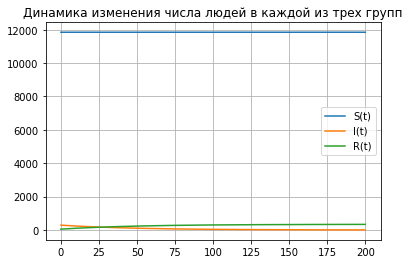
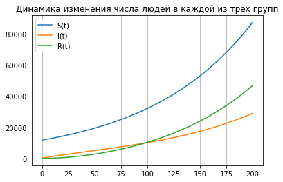

---
# Front matter
lang: ru-RU
title: "Отчет по лабораторной работе №6: Задача об эпидемии"
subtitle: "*дисциплина: Математическое моделирование*"
author: "Родина Дарья Алексеевна, НФИбд-03-18"


# Formatting
toc-title: "Содержание"
toc: true # Table of contents
toc_depth: 2
lof: true # List of figures
lot: true # List of tables
fontsize: 12pt
linestretch: 1.5
papersize: a4paper
documentclass: scrreprt
polyglossia-lang: russian
polyglossia-otherlangs: english
mainfont: PT Serif
romanfont: PT Serif
sansfont: PT Sans
monofont: PT Mono
mainfontoptions: Ligatures=TeX
romanfontoptions: Ligatures=TeX
sansfontoptions: Ligatures=TeX,Scale=MatchLowercase
monofontoptions: Scale=MatchLowercase
indent: true
pdf-engine: lualatex
header-includes:
  - \linepenalty=10 # the penalty added to the badness of each line within a paragraph (no associated penalty node) Increasing the value makes tex try to have fewer lines in the paragraph.
  - \interlinepenalty=0 # value of the penalty (node) added after each line of a paragraph.
  - \hyphenpenalty=50 # the penalty for line breaking at an automatically inserted hyphen
  - \exhyphenpenalty=50 # the penalty for line breaking at an explicit hyphen
  - \binoppenalty=700 # the penalty for breaking a line at a binary operator
  - \relpenalty=500 # the penalty for breaking a line at a relation
  - \clubpenalty=150 # extra penalty for breaking after first line of a paragraph
  - \widowpenalty=150 # extra penalty for breaking before last line of a paragraph
  - \displaywidowpenalty=50 # extra penalty for breaking before last line before a display math
  - \brokenpenalty=100 # extra penalty for page breaking after a hyphenated line
  - \predisplaypenalty=10000 # penalty for breaking before a display
  - \postdisplaypenalty=0 # penalty for breaking after a display
  - \floatingpenalty = 20000 # penalty for splitting an insertion (can only be split footnote in standard LaTeX)
  - \raggedbottom # or \flushbottom
  - \usepackage{float} # keep figures where there are in the text
  - \floatplacement{figure}{H} # keep figures where there are in the text
---

# Введение

## Цель работы

Основной целью лабораторной работы можно считать ознакомление с задачей об эпидемии.

## Задачи

Можно выделить три основные задачи данной лабораторной работы:  
1. изучение теоретической части;  
2. реализация модели на языке программирования python. 

## Объект и предмет исследования

Объектом исследования в данной лабораторной работе является задача об эпидемии, а предметом исследования - задача, описанная в моем варианте лабораторной работы.

# Задача об эпидеми

## Простейшая модель эпидемии

Предположим, что существует некая популяция, состоящая из $N$ особей, которая подразделяется на три группы:  
1. восприимчивые к болезни, но пока здоровые особи - $S(t)$;  
2. число инфицированных особей, которые также являются распространителями инфекции - $I(t)$;  
3. здоровые особи с иммунитетом к болезни - $R(t)$.  
До того, как число заболевших не превышает критического значения $I^{\prime}$, считаем, что все больные изолированы и не заражают здоровых. Когда $I(t) > I^{\prime}$, тогда инфицированные способны заражать восприимчивых к болезни особей.  
Таким образом, скорость изменения числа $S(t)$ меняется по следующему закону:  
$$
\frac{dS}{dt} =
  \begin{cases}
    \alpha S , \text{если } I(t) > I^{\prime}
    \\
    0, \text{если } I(t) \geq I^{\prime}
  \end{cases}
$$  
Поскольку каждая восприимчивая к болезни особь, которая, в конце концов, заболеет, сама становится инфецированной, то скорость изменения числа инфецированных особей представляет разность за еденицу времени между заразившимися и теми, кто уже болеет и лечится, т.е.:  
$$
\frac{dS}{dt} =
  \begin{cases}
    \alpha S - \beta I, \text{если } I(t) > I^{\prime}
    \\
    - \beta I, \text{если } I(t) \geq I^{\prime}
  \end{cases}
$$  
А скорость изменения выздоравливающих особей (при этом приобретающие иммунитет к болезни)  
$$
\frac{dR}{dt} = \beta I
$$  
Постоянные пропорциональности $\alpha$, $\beta$ - это коэффициенты заболеваемости и выздоровления соответственно.  
Для того, чтобы решения соответствующих уравнений определялось однозначно, необходимо задать начальные условия. Считаем, что на начало эпидемии в момент времени $t = 0$ нет особей и иммунитетом к болезни $R(0) = 0$, а число инфицированных и восприимчивых к болезни особей $I(0)$ и $S(0)$ соответственно. Для анализа картины протекания эпидемии необходимо рассмотреть два случая: $I(0) \geq I^{\prime}$ и $I(0) > I^{\prime}$. 

# Выполнение лабораторной работы

## Формулировка задачи из варианта

Так как в шестой лабораторной работе 70 вариантов, то номер моего варианта вычисляется по формуле $S_n mod 70 + 1$, где $S_n$ - номер студенческого билета (в моем случае $S_n = 1032182581$):
 
```py
  1032182581%70 + 1
```

Соответственно, номер моего варианта - 32. 

**Вариант 32**

На одном острове вспыхнула эпидемия. Известно, что из всех проживающих на острове ($N = 11 900$) в момент начала эпидемии ($t = 0$) число заболевших людей (являющихся распространителями инфекции) $I(0) = 290$, а число здоровых людей с иммунитетом к болезни $R(0) = 52$. Таким образом, число людей восприимчивых к болезни, но пока здоровых, в начальный момент времени $S(0) = N - I(0) - R(0)$.  
Постройте графики изменения числа особей в каждой из трех групп. Рассмотрите, как будет протекать эпидемия в случае:  
1. $I(0) \geq I^{\prime}$  
2. $I(0) > I^{\prime}$

## Реализация алгоритмов

### Подключение библиотек

Для того, чтобы использовать многие формулы, а также для построения графиков, необходимо подключить определенные библиотеки, в которых эти формулы описаны:

```py
import numpy as np
from scipy.integrate import odeint
import matplotlib.pyplot as plt
```

### Функция, описывающая дифференциальные уравнения

Функция для решение системы дифференциальных уравнений для первого случая имеет вид: 

```py 
# I(0) <= I
def dy_more(x, t):
    dy1 = 0
    dy2 = - beta * x[1]
    dy3 = beta * x[1]
    return [dy1, dy2, dy3]
```

для второго случая имеет вид:

```py 
# I(0) > I 
def dy_less(x, t):
    dy1 = alpha * x[0]
    dy2 = alpha * x[0] - beta * x[1]
    dy3 = beta * x[1]
    return [dy1, dy2, dy3]
```

### Построение графика функции 

Для удобства вынесем построение графика в отдельную функцию:

```py
def draw_plot(S, I, R, t):
    plt.plot(t, S, label = 'S(t)')
    plt.plot(t, I, label = 'I(t)')
    plt.plot(t, R, label = 'R(t)')
    plt.title("Динамика изменения числа людей в каждой из трех групп")
    plt.legend()
    plt.grid()
    plt.show()
```

### Начальные значения

Начальные условия задаются следующим образом:

```py 
alpha = 0.01 # коэффициент заболеваемости
beta = 0.02 # коэффициент выздоровления
N = 11900 # общая численность популяции
I0 = 290 # количество инфицированных особей в t0 = 0
R0 = 52 # количество здоровых особей с иммунитетом в t0 = 0
S0 = N - R0 # количество восприимчивых к болезни особей в t0 = 0

# временной промежуток
t0 = 0
t = np.arange(0, 200, 0.01)

# вектор начальных значений
y0 = np.array([S0, I0, R0]) 
```

### Решение диффееренциального уравнения и построение графиков

```py
y = odeint(dy_more, y0, t)

S = [elem[0] for elem in y] 
I = [elem[1] for elem in y] 
R = [elem[2] for elem in y] 

draw_plot(S, I, R, t)
```

```py
y = odeint(dy_less, y0, t)

S = [elem[0] for elem in y] 
I = [elem[1] for elem in y] 
R = [elem[2] for elem in y] 

draw_plot(S, I, R, t)
```

## Построенные графики

При запуске получившейся программы получаем следующие графики (рис. -@fig:001, рис. -@fig:002):

{ #fig:001 width=70% }

{ #fig:002 width=70% }

# Вывод

При выполнении лабораторной работы мною были усвоены основные приципы задачи об эпидемии, а также проведена реализация данной модели в рамках моего варианта лабораторной работы. 