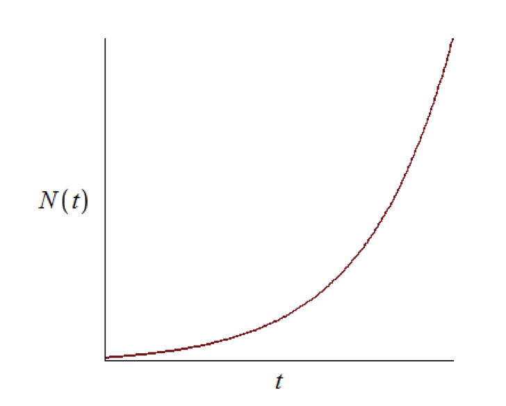
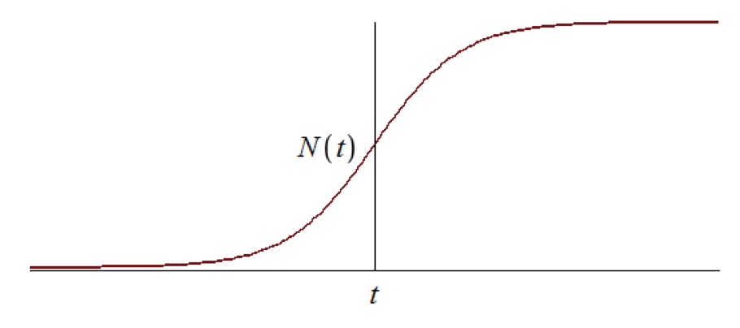
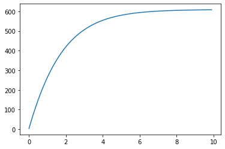
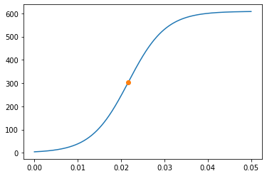
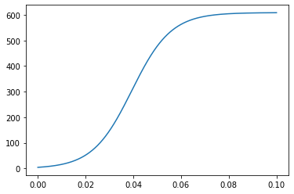

---
## Front matter
lang: ru-RU
title: "Отчет по лабораторной работе №7: Эффективность рекламы"
subtitle: "*дисциплина: Математическое моделирование*"
author: "Родина Дарья Алексеевна, НФИбд-03-18"

## Formatting
toc: false
slide_level: 2
theme: metropolis
header-includes:
 - \metroset{progressbar=frametitle,sectionpage=progressbar,numbering=fraction}
 - '\makeatletter'
 - '\beamer@ignorenonframefalse'
 - '\makeatother'
aspectratio: 43
section-titles: true

---

# Введение

Основной **целью лабораторной работы** можно считать построение математической модели для выбора правильной стратегии при решении задачи об эффективности рекламы.

Можно выделить три основные **задачи данной лабораторной работы**:  
1. изучить теоретическую часть модели, описывающией эффективность рекламы;  
2. реализовать частные случаи модели из моего варианта на одном из представленных языков программирования.

**Объектом исследования** в данной лабораторной работе является модель, описывающая эффективность рекламы, а **предметом исследования** - частные случаи, представленные в моем варианте лабораторной работы.

# Эффективность рекламы

## Описание модели эффективности рекламы

Математическая модель распространения рекламы описывается уравнением:  
$$
\frac{dn}{dt} = (a_1(t) + a_2(t) n(t))(N - n(t))
$$  

$t$ - время, прошедшее с начала рекламной кампании  
$N$ - число потенциальных покупателей  
$n$ - число уже информированных клиентов  
$\frac{dn}{dt}$ - скорость изменения со временем числа потребителей, узнавших о товаре и готовых его купить  
$a_1(t) > 0$ - характеризует интенсивность рекламной кампании  
$a_2(t) > 0$ - характеризует интенсивность сарафанного радио

## Описание модели эффективности рекламы

При $a_1(t) >> a_2(t)$ получается модель типа модели Мальтуса, решение которой имеет вид (рис. -@fig:001):

{ #fig:001 width=70% }  

## Описание модели эффективности рекламы

В обратном случае, при $a_1(t) << a_2(t)$ получаем уравнение логистической кривой (рис. -@fig:002):

{ #fig:002 width=70% }

# Выполнение лабораторной работы

## Формулировка задачи из варианта

**Вариант 32**

Постройте график распространения рекламы, математическая модель которой описывается следующим уравнением:  
1. $\frac{dn}{dt} = (0.54 + 0.00016 n(t))(N - n(t))$  
2. $\frac{dn}{dt} = (0.000021 + 0.38 n(t))(N - n(t))$  
3. $\frac{dn}{dt} = (0.2 cos(t) + 0.2 cos(2t) n(t))(N - n(t))$  
При этом объем аудитории $N = 609$, в начальный момент о товаре знает 4 человек. Для случая 2 определите в какой момент времени скорость распространения рекламы будет иметь максимальное значение. 

## Реализация алгоритмов

```py 
import numpy as np
from scipy.integrate import odeint
import matplotlib.pyplot as plt
from math import cos

t0 = 0 
x0 = 4 

N = 609 

t = np.arange(t0, 10, 0.1)
```

## Реализация алгоритмов

```py
def k(t):
    g = 0.54
    return g

def p(t):
    v = 0.00016
    return v
```

## Реализация алгоритмов

```py 
def f(x, t):
    dx = (k(t) + p(t) * x[0]) * (N - x[0])
    return dx

x = odeint(f, x0, t)

plt.plot(t, x)
```

## Реализация алгоритмов

```py
n = x.size

v = 0
k = -1
for i in range(n - 2):
    if x[i+1] - x[i] > k:
        k = x[i+1] - x[i]
        v = i

plt.plot(t[v], x[v], marker = 'o')
```

# Построенные графики

## Первый случай (рис. -@fig:003):

{ #fig:003 width=70% }

## Второй случай (рис. -@fig:004):

{ #fig:004 width=70% }

## Третий случай (рис. -@fig:005):

{ #fig:005 width=70% }

# Вывод

При выполнении лабораторной работы мною были усвоены основные приципы модели, описывающей эффективность рекламы, а также проведена реализация данной модели в рамках моего варианта лабораторной работы. 
