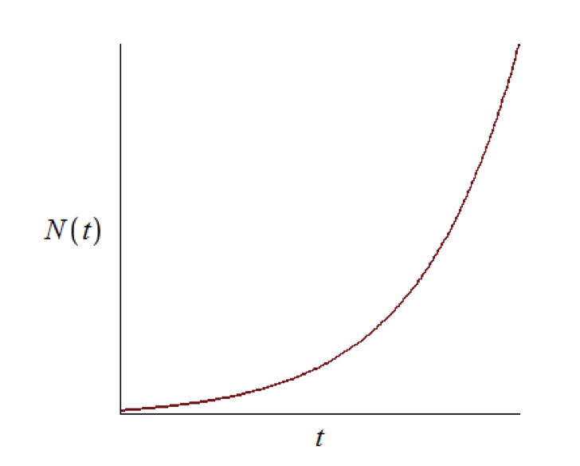
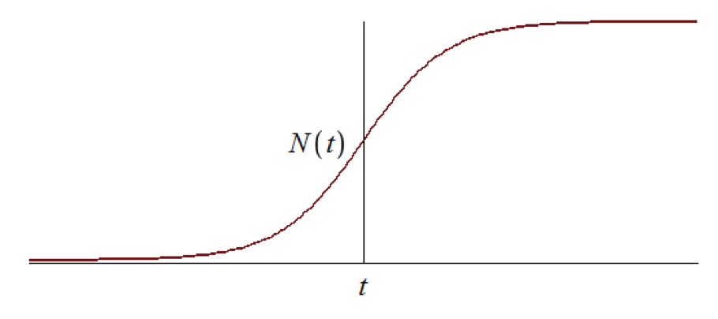
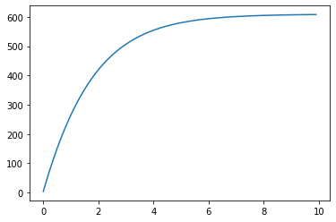
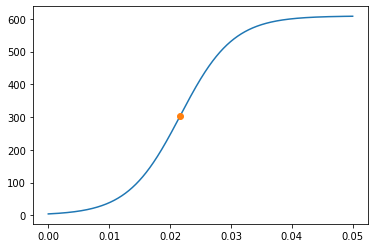
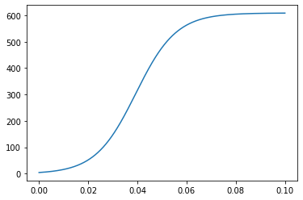

---
# Front matter
lang: ru-RU
title: "Отчет по лабораторной работе №7: Эффективность рекламы"
subtitle: "*дисциплина: Математическое моделирование*"
author: "Родина Дарья Алексеевна, НФИбд-03-18"


# Formatting
toc-title: "Содержание"
toc: true # Table of contents
toc_depth: 2
lof: true # List of figures
fontsize: 12pt
linestretch: 1.5
papersize: a4paper
documentclass: scrreprt
polyglossia-lang: russian
polyglossia-otherlangs: english
mainfont: PT Serif
romanfont: PT Serif
sansfont: PT Sans
monofont: PT Mono
mainfontoptions: Ligatures=TeX
romanfontoptions: Ligatures=TeX
sansfontoptions: Ligatures=TeX,Scale=MatchLowercase
monofontoptions: Scale=MatchLowercase
indent: true
pdf-engine: lualatex
header-includes:
  - \linepenalty=10 # the penalty added to the badness of each line within a paragraph (no associated penalty node) Increasing the value makes tex try to have fewer lines in the paragraph.
  - \interlinepenalty=0 # value of the penalty (node) added after each line of a paragraph.
  - \hyphenpenalty=50 # the penalty for line breaking at an automatically inserted hyphen
  - \exhyphenpenalty=50 # the penalty for line breaking at an explicit hyphen
  - \binoppenalty=700 # the penalty for breaking a line at a binary operator
  - \relpenalty=500 # the penalty for breaking a line at a relation
  - \clubpenalty=150 # extra penalty for breaking after first line of a paragraph
  - \widowpenalty=150 # extra penalty for breaking before last line of a paragraph
  - \displaywidowpenalty=50 # extra penalty for breaking before last line before a display math
  - \brokenpenalty=100 # extra penalty for page breaking after a hyphenated line
  - \predisplaypenalty=10000 # penalty for breaking before a display
  - \postdisplaypenalty=0 # penalty for breaking after a display
  - \floatingpenalty = 20000 # penalty for splitting an insertion (can only be split footnote in standard LaTeX)
  - \raggedbottom # or \flushbottom
  - \usepackage{float} # keep figures where there are in the text
  - \floatplacement{figure}{H} # keep figures where there are in the text
---

# Введение

## Цель работы

Основной целью лабораторной работы можно считать построение математической модели для выбора правильной стратегии при решении задачи об эффективности рекламы.

## Задачи

Можно выделить три основные задачи данной лабораторной работы:
1. изучить теоретическую часть модели, описывающией эффективность рекламы;
2. реализовать частные случаи модели из моего варианта на одном из представленных языков программирования.

## Объект и предмет исследования

Объектом исследования в данной лабораторной работе является модель, описывающая эффективность рекламы, а предметом исследования - частные случаи, представленные в моем варианте лабораторной работы.

# Эффективность рекламы

## Описание модели эффективности рекламы

Предположим, что торговыми учреждениями реализуется некоторая продукция, о которой в момент времени $t$ из числа потенциальных покупателей $N$ знает лишь $n$ покупателей. Для ускорения сбыта продукции запускается реклама по радио, телевидению и других средств массовой информации. После запуска рекламной кампании информация о продукции начнет распространяться среди потенциальных покупателей путем общения друг с другом. Таким образом, после запуска рекламных объявлений скорость изменения числа знающих о продукции людей пропорциональна как числу знающих о товаре покупателей, так и числу покупателей о нем не знающих.  
Модель рекламной кампании описывается следующими величинами. Считаем, что $\frac{dn}{dt}$ - скорость изменения со временем числа потребителей, узнавших о товаре и готовых его купить, $t$ - время, прошедшее с начала рекламной кампании, $n(t)$ - число уже информированных клиентов. Эта величина пропорциональна числу покупателей, еще не знающих о нем, это описывается следующим образом: $a_1(t)(N - n(t))$, где $N$ - общее число потенциальных платежеспособных покупателей, $a_1(t) > 0$ - характеризует интенсивность рекламной кампании (зависит от затрат на рекламу в данный момент времени). Помимо этого, узнавшие о товаре потребители также распространяют полученную информацию среди потенциальных покупателей, не знающих о нем (в этом случае работает т.н. сарафанное радио). Этот вклад в рекламу описывается величиной $a_2(t)n(t)(N - n(t))$, эта величина увеличивается с увеличением потребителей узнавших о товаре. Математическая модель распространения рекламы описывается уравнением:  
$$
\frac{dn}{dt} = (a_1(t) + a_2(t) n(t))(N - n(t))
$$  
При $a_1(t) >> a_2(t)$ получается модель типа модели Мальтуса, решение которой имеет вид (рис. -@fig:001):

{ #fig:001 width=70% }  

В обратном случае, при $a_1(t) << a_2(t)$ получаем уравнение логистической кривой (рис. -@fig:002):

{ #fig:002 width=70% }

# Выполнение лабораторной работы

## Формулировка задачи из варианта

Так как в седьмой лабораторной работе 70 вариантов, то номер моего варианта вычисляется по формуле $S_n mod 70 + 1$, где $S_n$ - номер студенческого билета (в моем случае $S_n = 1032182581$):
 
```py
  1032182581%70 + 1
```

Соответственно, номер моего варианта - 32. 

**Вариант 32**

Постройте график распространения рекламы, математическая модель которой описывается следующим уравнением:  
1. $\frac{dn}{dt} = (0.54 + 0.00016 n(t))(N - n(t))$  
2. $\frac{dn}{dt} = (0.000021 + 0.38 n(t))(N - n(t))$  
3. $\frac{dn}{dt} = (0.2 cos(t) + 0.2 cos(2t) n(t))(N - n(t))$  
При этом объем аудитории $N = 609$, в начальный момент о товаре знает 4 человек. Для случая 2 определите в какой момент времени скорость распространения рекламы будет иметь максимальное значение. 

## Реализация алгоритмов

### Подключение библиотек

Для того, чтобы использовать многие формулы, а также для построения графиков, необходимо подключить определенные библиотеки, в которых эти формулы описаны:

```py
import numpy as np
from scipy.integrate import odeint
import matplotlib.pyplot as plt
from math import cos
```

### Функции, описывающие факторы, влияющие на эффективность рекламы

Платная реклама:

```py
def k(t):
    g = 0.54
    return g
```

Сарафанное радио:

```py
def p(t):
    v = 0.00016
    return v
```

### Функция, описывающая дифференциальные уравнения

Функция для решения дифференциального уравнения имеет вид: 

```py 
# Уравнение, описывающее распространение рекламы
def f(x, t):
    dx = (k(t) + p(t) * x[0]) * (N - x[0])
    return dx
```

### Начальные значения

Начальные условия задаются следующим образом:

```py 
t0 = 0 # Начальный момент времени
# Количество людей, знающих о товаре в начальный момент времени
x0 = 4 
# Максимальное количество людей, которых может заинтересовать товар 
N = 609 
# временной промежуток (длительность рекламной кампании)
t = np.arange(t0, 10, 0.1)
```

Для каждого случая длительность рекламной кампании была разная. 

### Решение дифференциального уравнения и построение графиков

```py
x = odeint(f, x0, t)

plt.plot(t, x)
```

Для второго случая необходимо было найти момент времени, в которой скорость была максимальной: 

```py
n = x.size

v = 0
k = -1
for i in range(n - 2):
    if x[i+1] - x[i] > k:
        k = x[i+1] - x[i]
        v = i

plt.plot(t[v], x[v], marker = 'o')
```

## Построенные графики

Первый случай (рис. -@fig:003):

{ #fig:003 width=70% }

Второй случай (рис. -@fig:004):

{ #fig:004 width=70% }

Третий случай (рис. -@fig:005):

{ #fig:005 width=70% }

# Вывод

При выполнении лабораторной работы мною были усвоены основные приципы модели, описывающей эффективность рекламы, а также проведена реализация данной модели в рамках моего варианта лабораторной работы. 