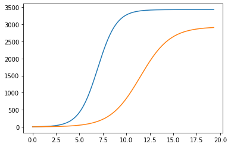
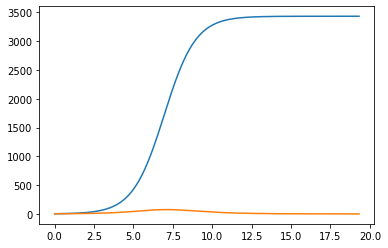

---
## Front matter
lang: ru-RU
title: "Отчет по лабораторной работе №8: Модель конкуренции двух фирм"
subtitle: "*дисциплина: Математическое моделирование*"
author: "Родина Дарья Алексеевна, НФИбд-03-18"

## Formatting
toc: false
slide_level: 2
theme: metropolis
header-includes:
 - \metroset{progressbar=frametitle,sectionpage=progressbar,numbering=fraction}
 - '\makeatletter'
 - '\beamer@ignorenonframefalse'
 - '\makeatother'
aspectratio: 43
section-titles: true

---

# Введение

Основной **целью лабораторной работы** можно считать построение математической модели конкуренции двух фирм.

Можно выделить две основные **задачи данной лабораторной работы**:  
1. изучить теоретическую часть модели конкуренции двух фирм;  
2. реализовать частные случаи модели из моего варианта на одном из представленных языков программирования.

**Объектом** исследования в данной лабораторной работе является модель, описывающая конкуренцию двух фирм, а **предметом** исследования - частные случаи, представленные в моем варианте лабораторной работы.

# Выполнение лабораторной работы

## Формулировка задачи из варианта

**Случай 1.** Рассмотрим две фирмы, производящие взаимозаменяемые товары одинакового качества и находящиеся в одной рыночной нише. Считаем, что в рамках нашей модели конкурентная борьба ведётся только рыночными методами. То есть, конкуренты могут влиять на противника путем изменения параметров своего производства: себестоимость, время цикла, но не могут прямо вмешиваться в ситуацию на рынке («назначать» цену или влиять на потребителей каким-либо иным способом.) Будем считать, что постоянные издержки пренебрежимо малы, и в модели учитывать не будем. В этом случае динамика изменения объемов продаж фирмы 1 и фирмы 2 описывается следующей системой уравнений:

## Формулировка задачи из варианта

$$\frac{dM_1}{d\theta}=M_1-\frac{b}{c_1}M_1M_2-\frac{a_1}{c_1}M_1^2$$  
$$\frac{dM_2}{d\theta}=\frac{c_2}{c_1}M_2-\frac{b}{c_1}M_1M_2-\frac{a_2}{c_1}M_2^2$$

## Формулировка задачи из варианта

**Случай 2.** Рассмотрим модель, когда, помимо экономического фактора влияния (изменение себестоимости, производственного цикла, использование кредита и т.п.), используются еще и социально-психологические факторы – формирование общественного предпочтения одного товара другому, не зависимо от их качества и цены. В этом случае взаимодействие двух фирм будет зависеть друг от друга, соответственно коэффициент перед $M_1M_2$ будет отличаться. Пусть в рамках рассматриваемой модели динамика изменения объемов продаж фирмы 1 и фирмы 2 описывается следующей системой уравнений:

## Формулировка задачи из варианта

$$\frac{dM_1}{d\theta}=M_1-\frac{b}{c_1}M_1M_2-\frac{a_1}{c_1}M_1^2$$  
$$\frac{dM_2}{d\theta}=\frac{c_2}{c_1}M_2-(\frac{b}{c_1} + 0.00033)M_1M_2-\frac{a_2}{c_1}M_2^2$$ 

## Формулировка задачи из варианта

Для обоих случаев задача рассматривается со следующими начальными условиями и параметрами:  
$N$ – число потребителей производимого продукта  
$\tau$ – длительность производственного цикла  
$p$ – рыночная цена товара  
$\tilde{p}$ – себестоимость продукта, то есть переменные издержки на производство единицы продукции  
$q$ – максимальная потребность одного человека в продукте в единицу времени  
$\theta=\frac{t}{c_1}$ - безразмерное время   

## Формулировка задачи из варианта

$M_0^1=5.5$  
$M_0^2=3.5$  
$p_{cr}=28$  
$N=30$  
$q=1$  
$\tau_1=10$  
$\tau_2=12$  
$\tilde{p_1}=10$  
$\tilde{p_2}=8.2$

## Формулировка задачи из варианта

$a_1=\frac{p_{cr}}{\tau_1^2\tilde{p_1^2}Nq}$  
$a_2=\frac{p_{cr}}{\tau_2^2\tilde{p_2^2}Nq}$  
$b=\frac{p_{cr}}{\tau_1^2\tilde{p_1^2}\tau_2^2\tilde{p_2^2}Nq}$  
$c_1=\frac{p_{cr}-\tilde{p_1}}{\tau_1\tilde{p_1}}$  
$c_2=\frac{p_{cr}-\tilde{p_2}}{\tau_2\tilde{p_2}}$  
$t=c_1\theta$ - условие нормировки

## Формулировка задачи из варианта

1. Постройте графики изменения оборотных средств фирмы 1 и фирмы 2 без учета постоянных издержек и с веденной нормировкой для случая 1.  
2. Постройте графики изменения оборотных средств фирмы 1 и фирмы 2 без учета постоянных издержек и с веденной нормировкой для случая 2.  

# Реализация алгоритмов

## Подключение библиотек

```python
import numpy as np
import matplotlib.pyplot as plt
from scipy.integrate import odeint
```

## Начальные значения

Начальные условия задаются следующим образом:

```py 
p_cr=26 # критическая стоимость продукта
tau1=24 # длительность производственного цикла фирмы 1
p1=5.5 # себестоимость продукта у фирмы 1
tau2=14 # длительность производственного цикла фирмы 2
p2=11 # себестоимость продукта у фирмы 2
N=33 # число потребителей производимого продукта
# максимальная потребность одного человека 
# в продукте в единицу времени
q=1
```

## Начальные значения

Также необходимо посчитать коэффициенты, учавствующие в решении дифференциального уравнения:

```python
a1=p_cr/(tau1*tau1*p1*p1*N*q)
a2=p_cr/(tau2*tau2*p2*p2*N*q)
b=p_cr/(tau1*tau1*tau2*tau2*p1*p1*p2*p2*N*q) 
c1=(p_cr-p1)/(tau1*p1)
c2=(p_cr-p2)/(tau2*p2)
```

## Начальные значения

Начальные значения системы:

```python
x0 = np.array([3.3, 2.2])
t = np.arange(0, 3, 0.001)

t = t/c1
```

## Функция, описывающая дифференциальные уравнения

Для первого случая:

```python
def syst1(x,t):
    dx0=x[0]-(a1/c1)*x[0]*x[0]-(b/c1)*x[0]*x[1] 
    dx1=(c2/c1)*x[1]-(a2/c1)*x[1]*x[1]-(b/c1)*x[0]*x[1]
    return [dx0,dx1]
```

## Функция, описывающая дифференциальные уравнения

Для второго случая: 

```python
def syst2(x,t):
    dx0=x[0]-(a1/c1)*x[0]*x[0]-(b/c1)*x[0]*x[1] 
    dx1=(c2/c1)*x[1]-(a2/c1)*x[1]*x[1]-
    	(b/c1+0.00033)*x[0]*x[1]
    return [dx0,dx1]
```

## Решение дифференциального уравнения и построение графиков

Для первого случая:

```python
x = odeint(syst1, x0, t)

plt.plot(t, x)
```

Для второго случая:

```python
x = odeint(syst2, x0, t)

plt.plot(t, x)
```

## Построенные графики

При построении графика для случая, когда конкурентная борьба ведётся только рыночными методами, получила следующий результат (рис. -@fig:001):

{#fig:001 width=70%}

## Построенные графики

При построении графика для случая, когда, помимо экономического фактора влияния, используются еще и социально-психологические факторы (рис. -@fig:002):

{#fig:002 width=70%}

# Вывод

При выполнении лабораторной работы мною были усвоены основные приципы модели конкуренции двух фирм, а также проведена реализация данной модели в рамках моего варианта лабораторной работы. 