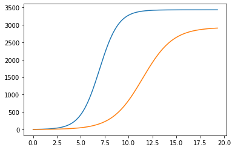
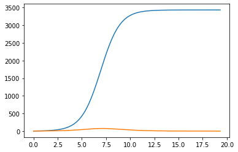

---
# Front matter
lang: ru-RU
title: "Отчет по лабораторной работе №8: Модель конкуренции двух фирм"
subtitle: "*дисциплина: Математическое моделирование*"
author: "Родина Дарья Алексеевна, НФИбд-03-18"


# Formatting
toc-title: "Содержание"
toc: true # Table of contents
toc_depth: 2
lof: true # List of figures
fontsize: 12pt
linestretch: 1.5
papersize: a4paper
documentclass: scrreprt
polyglossia-lang: russian
polyglossia-otherlangs: english
mainfont: PT Serif
romanfont: PT Serif
sansfont: PT Sans
monofont: PT Mono
mainfontoptions: Ligatures=TeX
romanfontoptions: Ligatures=TeX
sansfontoptions: Ligatures=TeX,Scale=MatchLowercase
monofontoptions: Scale=MatchLowercase
indent: true
pdf-engine: lualatex
header-includes:
  - \linepenalty=10 # the penalty added to the badness of each line within a paragraph (no associated penalty node) Increasing the value makes tex try to have fewer lines in the paragraph.
  - \interlinepenalty=0 # value of the penalty (node) added after each line of a paragraph.
  - \hyphenpenalty=50 # the penalty for line breaking at an automatically inserted hyphen
  - \exhyphenpenalty=50 # the penalty for line breaking at an explicit hyphen
  - \binoppenalty=700 # the penalty for breaking a line at a binary operator
  - \relpenalty=500 # the penalty for breaking a line at a relation
  - \clubpenalty=150 # extra penalty for breaking after first line of a paragraph
  - \widowpenalty=150 # extra penalty for breaking before last line of a paragraph
  - \displaywidowpenalty=50 # extra penalty for breaking before last line before a display math
  - \brokenpenalty=100 # extra penalty for page breaking after a hyphenated line
  - \predisplaypenalty=10000 # penalty for breaking before a display
  - \postdisplaypenalty=0 # penalty for breaking after a display
  - \floatingpenalty = 20000 # penalty for splitting an insertion (can only be split footnote in standard LaTeX)
  - \raggedbottom # or \flushbottom
  - \usepackage{float} # keep figures where there are in the text
  - \floatplacement{figure}{H} # keep figures where there are in the text
---

# Введение

## Цель работы

Основной целью лабораторной работы можно считать построение математической модели конкуренции двух фирм.

## Задание

Можно выделить две основные задачи данной лабораторной работы:  
1. изучить теоретическую часть модели конкуренции двух фирм;  
2. реализовать частные случаи модели из моего варианта на одном из представленных языков программирования.

## Объект и предмет исследования

Объектом исследования в данной лабораторной работе является модель, описывающая конкуренцию двух фирм, а предметом исследования - частные случаи, представленные в моем варианте лабораторной работы.

# Модель конуренции двух фирм

## Модель одной фирмы

Модель фирмы, производящией продукт долговременного пользования, когда цена его определяется балансом спроса и предложения. Примем, что этот продукт занимает определенную нишу рынка и конкуренты в ней отсутствуют. Обозначим:  
$N$ - число потребителей производимого продукта;  
$S$ - доходы потребителей данного продукта (считаем, что доходлы всех потребителей одинаковы);  
$M$ - оборотные средства предприятия;  
$\tau$ - длительность производственного цикла;  
$p$ - рыночная цена товара;  
$\tilde{p}$ - себестоимость продукта;  
$\delta$ - доля оборотных средств, идущая на покрытие переменных издержек;  
$k$ - постоянные издержки, которые не зависят от количества выпускаемой продукции.  
Функцию спроса товаров долговременного испрользования частро представляют в простейшей форме:
$$
Q = q - k \frac{p}{S} = q(1 - \frac{p}{p_{cr}})
$$  
где $q$ - максимальная потребность одного человека в продукте в еденицу времени, $p_{cr}$ - критическая стоимость продукта. Эта функция падает при $p = p_{cr}$. Величина $p_cr = S q / k$. Параметр $k$ – мера эластичности функции спроса по цене. Таким образом, функция спроса в форме (1) является пороговой (то есть, $Q(S/p) = 0$ при $p \geq p_{cr}$) и обладает свойствами насыщения. 

Уравнения динамики оборотных средств средств можно записать в виде

\begin{equation}
\frac{dM}{dt}=-\frac{M\delta}{\tau}+NQp-\kappa=-\frac{M\delta}{\tau}+Nq(1-\frac{p}{p_{cr}})p-\kappa
\end{equation}

Уравнение для рыночной цены $p$ представим в виде

\begin{equation}
\frac{dp}{dt}=\gamma(-\frac{M\delta}{\tau\tilde{p}}+Nq(1-\frac{p}{p_{cr}}))
\end{equation}

Первый член соответствует количеству поставляемого на рынок товара (то есть, предложению), а второй член – спросу. Параметр $\gamma$ зависит от скорости оборота товаров на рынке. Как правило, время торгового оборота существенно меньше времени производственного цикла $\tau$. При заданном $M$ уравнение (3) описывает быстрое стремление цены к равновесному значению цены, которое устойчиво.
В этом случае уравнение (3) можно заменить алгебраическим соотношением

\begin{equation}
-\frac{M\delta}{\tau\tilde{p}}+Nq(1-\frac{p}{p_{cr}})=0
\end{equation}

Из (4) следует, что равновесное значение цены $p$ равно

\begin{equation}
p=p_{cr}(1-\frac{M\delta}{\tau\tilde{p}Nq})
\end{equation}

Уравнение (2) с учетом (5) приобретает вид

\begin{equation}
\frac{dM}{dt}=M\frac{\delta}{\tau}(\frac{p_{cr}}{\tilde{p}}-1)-M^2(\frac{\delta}{\tau\tilde{p}})^2\frac{p_{cr}}{Nq}-\kappa
\end{equation}

Рассмотрим две фирмы, производящие взаимозаменяемые товары одинакового качества и находящиеся в одной рыночной нише. Последнее означает, что у потребителей в этой нише нет априорных предпочтений, и они приобретут тот или иной товар, не обращая внимания на знак фирмы.
В этом случае, на рынке устанавливается единая цена, которая определяется балансом суммарного предложения и спроса. Иными словами, в рамках нашей модели конкурентная борьба ведётся только рыночными методами. То есть, конкуренты могут влиять на противника путем изменения параметров своего производства: себестоимость, время цикла, но не могут прямо вмешиваться в ситуацию на рынке («назначать» цену или влиять на потребителей какимлибо иным способом.)
Уравнения динамики оборотных средств запишем по аналогии с (2) в виде

\begin{equation}
\frac{dM_1}{dt}=-\frac{M_1}{\tau_1}+N_1q(1-\frac{p}{p_{cr}})p-\kappa_1  
\frac{dM_2}{dt}=-\frac{M_2}{\tau_2}+N_2q(1-\frac{p}{p_{cr}})p-\kappa_2
\end{equation}

где использованы те же обозначения, а индексы 1 и 2 относятся к первой и второй фирме, соответственно. Величины N1 и N2 – числа потребителей, приобретших товар первой и второй фирмы.
Учтем, что товарный баланс устанавливается быстро, то есть, произведенный каждой фирмой товар не накапливается, а реализуется по цене $p$.
Тогда

\begin{equation}
\frac{M_1}{\tau_1\tilde{p_1}}=N_1q(1-\frac{p}{p_{cr}})  
\frac{M_2}{\tau_2\tilde{p_2}}=N_2q(1-\frac{p}{p_{cr}})
\end{equation}

где $\tilde{p_1}$ и $\tilde{p_2}$ – себестоимости товаров в первой и второй фирме.
С учетом (10) представим (11) в виде

\begin{equation}
\frac{dM_1}{dt}=-\frac{M_1}{\tau_1}(1-\frac{p}{\tilde{p_1}})-\kappa_1  
\frac{dM_2}{dt}=-\frac{M_2}{\tau_2}(1-\frac{p}{\tilde{p_2}})-\kappa_2
\end{equation}

Уравнение для цены, по аналогии с (3),

\begin{equation}
\frac{dp}{dt}=-\gamma(\frac{M_1}{\tau_1\tilde{p_1}}+\frac{M_2}{\tau_2\tilde{p_2}}-Nq(1-\frac{p}{p_{cr}}))  
\end{equation}

Считая, как и выше, что ценовое равновесие устанавливается быстро, получим

\begin{equation}
p=p_{cr}(1-\frac{1}{Nq}(\frac{M_1}{\tau_1\tilde{p_1}}+\frac{M_2}{\tau_2\tilde{p_2}}))
\end{equation}

Подставив (14) в (12) имеем:

\begin{equation}
\frac{dM_1}{dt}=c_1M_1-bM_1M_2-a_1M_1^2-\kappa_1  
\frac{dM_2}{dt}=c_2M_2-bM_1M_2-a_2M_2^2-\kappa_2
\end{equation}

где $a_1=\frac{p_{cr}}{\tau_1^2\tilde{p_1^2}Nq}, a_2=\frac{p_{cr}}{\tau_2^2\tilde{p_2^2}Nq}, b=\frac{p_{cr}}{\tau_1^2\tilde{p_1^2}\tau_2^2\tilde{p_2^2}Nq}, c_1=\frac{p_{cr}-\tilde{p_1}}{\tau_1\tilde{p_1}}, c_2=\frac{p_{cr} \tilde{p_2}}{\tau_2\tilde{p_2}}$

Исследуем систему (15) в случае, когда постоянные издержки ($\kappa_1$, $\kappa_2$) пренебрежимо малы. И введем нормировку $t=c_1\theta$. Получим следующую систему:

\begin{equation}
\frac{dM_1}{d\theta}=M_1-\frac{b}{c_1}M_1M_2-\frac{a_1}{c_1}M_1^2
\frac{dM_2}{d\theta}=\frac{c_2}{c_1}M_2-\frac{b}{c_1}M_1M_2-\frac{a_2}{c_1}M_2^2
\end{equation}

Пусть помимо экономического фактора влияния (изменение себестоимости, производственного цикла, использование кредита и т.п.), используются еще и социально-психологические факторы – формирование общественного предпочтения одного товара другому, не зависимо от их качества и цены. В этом случае взаимодействие двух фирм будет зависеть друг от друга, соответственно коэффициент перед $M_1M_2$ будет отличаться.

# Выполнение лабораторной работы

## Формулировка задачи из варианта

Так как в седьмой лабораторной работе 70 вариантов, то номер моего варианта вычисляется по формуле $S_n mod 70 + 1$, где $S_n$ - номер студенческого билета (в моем случае $S_n = 1032182581$):
 
```py
  1032182581%70 + 1
```

Соответственно, номер моего варианта - 32. 

**Вариант 32**

**Случай 1.** Рассмотрим две фирмы, производящие взаимозаменяемые товары одинакового качества и находящиеся в одной рыночной нише. Считаем, что в рамках нашей модели конкурентная борьба ведётся только рыночными методами. То есть, конкуренты могут влиять на противника путем изменения параметров своего производства: себестоимость, время цикла, но не могут прямо вмешиваться в ситуацию на рынке («назначать» цену или влиять на потребителей каким-либо иным способом.) Будем считать, что постоянные издержки пренебрежимо малы, и в модели учитывать не будем. В этом случае динамика изменения объемов продаж фирмы 1 и фирмы 2 описывается следующей системой уравнений:

$$\frac{dM_1}{d\theta}=M_1-\frac{b}{c_1}M_1M_2-\frac{a_1}{c_1}M_1^2$$  
$$\frac{dM_2}{d\theta}=\frac{c_2}{c_1}M_2-\frac{b}{c_1}M_1M_2-\frac{a_2}{c_1}M_2^2$$

**Случай 2.** Рассмотрим модель, когда, помимо экономического фактора влияния (изменение себестоимости, производственного цикла, использование кредита и т.п.), используются еще и социально-психологические факторы – формирование общественного предпочтения одного товара другому, не зависимо от их качества и цены. В этом случае взаимодействие двух фирм будет зависеть друг от друга, соответственно коэффициент перед $M_1M_2$ будет отличаться. Пусть в рамках рассматриваемой модели динамика изменения объемов продаж фирмы 1 и фирмы 2 описывается следующей системой уравнений:

$$\frac{dM_1}{d\theta}=M_1-\frac{b}{c_1}M_1M_2-\frac{a_1}{c_1}M_1^2$$  
$$\frac{dM_2}{d\theta}=\frac{c_2}{c_1}M_2-(\frac{b}{c_1} + 0.00033)M_1M_2-\frac{a_2}{c_1}M_2^2$$ 

Для обоих случаев задача рассматривается со следующими начальными условиями и параметрами:  
$N$ – число потребителей производимого продукта  
$\tau$ – длительность производственного цикла  
$p$ – рыночная цена товара  
$\tilde{p}$ – себестоимость продукта, то есть переменные издержки на производство единицы продукции  
$q$ – максимальная потребность одного человека в продукте в единицу времени  
$\theta=\frac{t}{c_1}$ - безразмерное время   

$M_0^1=5.5, M_0^2=3.5,
p_{cr}=28, N=30, q=1,
\tau_1=10, \tau_2=12, \tilde{p_1}=10, \tilde{p_2}=8.2$

$a_1=\frac{p_{cr}}{\tau_1^2\tilde{p_1^2}Nq}, a_2=\frac{p_{cr}}{\tau_2^2\tilde{p_2^2}Nq}, b=\frac{p_{cr}}{\tau_1^2\tilde{p_1^2}\tau_2^2\tilde{p_2^2}Nq}, c_1=\frac{p_{cr}-\tilde{p_1}}{\tau_1\tilde{p_1}}, c_2=\frac{p_{cr}-\tilde{p_2}}{\tau_2\tilde{p_2}}$

$t=c_1\theta$ - условие нормировки

1. Постройте графики изменения оборотных средств фирмы 1 и фирмы 2 без учета постоянных издержек и с веденной нормировкой для случая 1.  
2. Постройте графики изменения оборотных средств фирмы 1 и фирмы 2 без учета постоянных издержек и с веденной нормировкой для случая 2.  

## Реализация алгоритмов

### Подключение библиотек

Для того, чтобы использовать многие формулы, а также для построения графиков, необходимо подключить определенные библиотеки, в которых эти формулы описаны:

```python
import numpy as np
import matplotlib.pyplot as plt
from scipy.integrate import odeint
```

### Начальные значения

Начальные условия задаются следующим образом:

```py 
# критическая стоимость продукта
p_cr=26 

# длительность производственного цикла фирмы 1
tau1=24

# себестоимость продукта у фирмы 1
p1=5.5 

# длительность производственного цикла фирмы 2
tau2=14

# себестоимость продукта у фирмы 2
p2=11

# число потребителей производимого продукта
N=33

# максимальная потребность одного человека в продукте в единицу времени
q=1
```

Также необходимо посчитать коэффициенты, учавствующие в решении дифференциального уравнения:

```python
a1=p_cr/(tau1*tau1*p1*p1*N*q)
a2=p_cr/(tau2*tau2*p2*p2*N*q)
b=p_cr/(tau1*tau1*tau2*tau2*p1*p1*p2*p2*N*q) 
c1=(p_cr-p1)/(tau1*p1)
c2=(p_cr-p2)/(tau2*p2)
```

Начальные значения системы:

```python
x0 = np.array([3.3, 2.2])
t = np.arange(0, 3, 0.001)

t = t/c1
```

### Функция, описывающая дифференциальные уравнения

Для первого случая:

```python
def syst1(x,t):
    dx0=x[0]-(a1/c1)*x[0]*x[0]-(b/c1)*x[0]*x[1] 
    dx1=(c2/c1)*x[1]-(a2/c1)*x[1]*x[1]-(b/c1)*x[0]*x[1]
    return [dx0,dx1]
```

Для второго случая: 

```python
def syst2(x,t):
    dx0=x[0]-(a1/c1)*x[0]*x[0]-(b/c1)*x[0]*x[1] 
    dx1=(c2/c1)*x[1]-(a2/c1)*x[1]*x[1]-(b/c1+0.00033)*x[0]*x[1]
    return [dx0,dx1]
```

### Решение дифференциального уравнения и построение графиков

Для первого случая:

```python
x = odeint(syst1, x0, t)

plt.plot(t, x)
```

Для второго случая:

```python
x = odeint(syst2, x0, t)

plt.plot(t, x)
```

## Построенные графики

### Случай 1

При построении графика для случая, когда конкурентная борьба ведётся только рыночными методами, получила следующий результат (рис. -@fig:001):

{#fig:001 width=70%}

### Случай 2

При построении графика для случая, когда, помимо экономического фактора влияния, используются еще и социально-психологические факторы (рис. -@fig:002):

{#fig:002 width=70%}

# Вывод

При выполнении лабораторной работы мною были усвоены основные приципы модели конкуренции двух фирм, а также проведена реализация данной модели в рамках моего варианта лабораторной работы. 